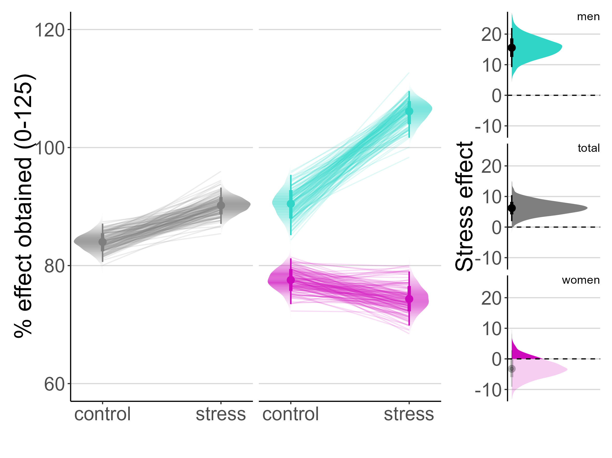
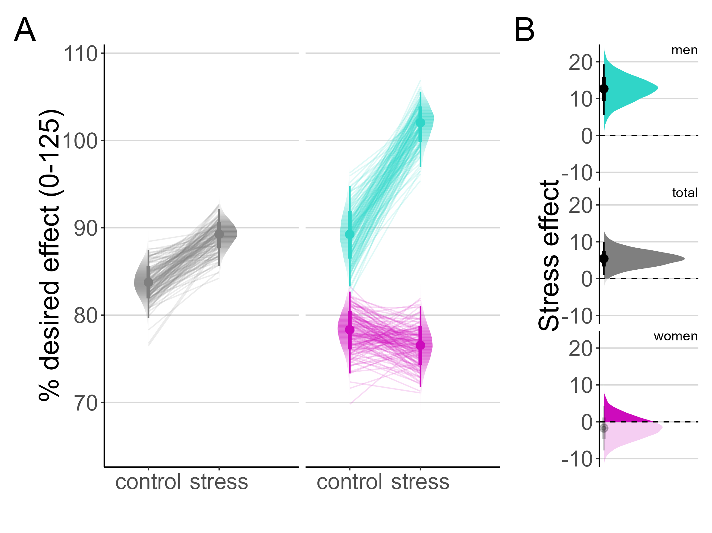

```{css, echo = F}
<!-- #TOC { -->
<!--   position: fixed; -->
<!--   left: 0; -->
<!--   top: 0; -->
<!--   width: 400px; -->
<!--   height: 100%; -->
<!--   overflow:auto; -->
<!-- } -->


.sidenote, .marginnote {
  float: right;
  clear: right;
  margin-right: 0#-50%;
  width: 40%;         # best between 50% and 60%
  margin-top: 0;
  margin-bottom: 0;
  line-height: 2;
  font-size: 1.8rem;
  vertical-align: baseline;
  position: relative;
  }
```


*Authors*: Marie Eikemo, Guro E Løseth, Molly Carlyle, Martin Trøstheim, Gernot Ernst, Claudia Pazmandi, Matthew Thompson, Cecilia Vezzani, Isabell M Meier, Tom Johnstone, Markus Heilig, Guido Biele, Siri Leknes

*Statistical analyses* were performed by Guido Biele, in collaboration with the author team.

Appeal doc: https://uio-my.sharepoint.com/:w:/r/personal/sirigra_uio_no/Documents/ERCproject/Dissemination/Manuscripts/Study1paper/Submissions/JAMA/Appeal/Appeal%20list.docx?d=w7d4575362e6f4fe897e6fc724d2a8c7c&csf=1&web=1&e=faGyG5

This R Markdown document contains analyses described in the [preregistration](https://osf.io/bcxv8) and in the [preprinted manuscript](https://osf.io/preprints/osf/v8dxy) together with data wrangling, visualizations and analyses performed to assess quality and properties of the data. The analyses uses custom functions, which can be found in the `utils.R` file, in order to avoind code repetition and to reduce the complexity of the code in this R markdown file.[^1]

[^1]: Because completing all analysis takes several hours, the Bayesian analyses described here were performed before producing the final R Markdown document. Minor adjustments to the code might be neccessary in order to successfully perform all analyses in one sweep using the R Markdown file.

Following files are needed to compile this R Markdown document:

- `utils.R` (utility functions) and `setup.R` (loads packages and defines colors and ggplot themes)
- some analyses are contained in these auxiliary R Markdown files: `buffer.Rmd`, `drug_side.Rmd`, `drug56.Rmd`, `drug_want_like.Rmd` 
- the data for this analysis were created from raw data with the script `collect_data.R` and `PrepHeartRateDate.R`
- data files with the prepared data are: 
  - `my_data_Questionnaire.Rdata`
  - `my_data_cortisol.Rdata`
  - `my_data_SelfAdmin.Rdata`
  - `dosage_data.Rdata` (drug dosages)
  - `HR.Rdata` (heart rate)

```{r setup, include=FALSE}
source("R/setup.R")
source("R/utils.R")
LONG_MODE = TRUE
pd.2 = position_dodge(.2)
rmd_output = opts_knit$get("rmarkdown.pandoc.to")
if (is.null(rmd_output)) rmd_output = "html"
if (!is.null(rmd_output))
  if (rmd_output == "docx") {
    theme_update(text = element_text(size = 10)) 
    knitr::opts_chunk$set(dpi=150,fig.width=7)
  }
knitr::opts_chunk$set(
  echo = ifelse(rmd_output == "html",TRUE,FALSE),
  warning = FALSE,
  message = FALSE,
  eval = TRUE)
```

# Prepare data

The analyses uses data files that were prepared from individual level raw data. We load the questionnaire, cortisol, heart rate and self administration data.

```{r load_data, eval = TRUE}
load("data/my_data_Questionnaire.Rdata")
my_data.Q = my_data
my_data.Q[item_name == "dull", item_name := "blunted"]
my_data.Q[participant == 22 & session == 1, Drug := "oxycodone"]

load("data/my_data_cortisol.Rdata")
my_data.cortisol = 
  my_data %>% 
  .[, result := result*100*0.0001] %>% 
  .[, log.result := log(result)] %>% 
  .[participant %in% unique(my_data$participant)]
my_data.cortisol[participant == 22 & session == 1, Drug := "oxycodone"]

load("data/my_data_SelfAdmin.Rdata")
my_data[participant == 22 & session == 1, Drug := "oxycodone"]
my_data = my_data

stage.names = c("BL 1", "BL 2", "BL 3", "state induction", "dose 1" , 
           "reminder 1", "self- admin", "reminder 2", "DM task",
           "cognitive task", "dose 2") %>% gsub(" ","\n",.)
my_data[, state.condition := ifelse(Stress == "stress", "stress", "control")] %>% 
  .[, Sex := ifelse(gender == "m","men","women")] 
my_data.Q[, state.condition := ifelse(Stress == "stress", "stress", "control")] %>% 
  .[, Sex := ifelse(gender == "m","men","women")] %>% 
  .[, induced.state := ifelse(Stress == "stress" & stage > 3, "stress", "control")] %>% 
  .[, Stage := factor(stage.names[stage], levels = stage.names)]
```

## Missing data

The experiment has complete VAS rating data, except for one session (for one participant, oxycodone + control induction) where data was lost due to a technical issue.

```{r}
the_data = make_the_data(my_data.Q)[, outcome := "stress"]
attr(the_data,"N")
```

We assess the number of available datasets from the main behavioral outcome from the drug self-administration task.

```{r}
# Calculate first time at target for self administration task.
my_data %>% 
  .[, first.time.target := 1e5 + 0.1] %>% 
  .[, `:=`(first.time.target = 
            get_ftt(effect_obtained,target, time, bias),
          mean.delta_effect_obtained = mean(abs(effect_obtained-target))),
        by = .(participant,session)]
```

```{r results='asis', echo = FALSE}
cat(paste(length(unique(my_data$participant)),"participants (",length(unique(my_data[Sex == "women", participant])),"women) are included in the analysis."))
```

## Exclusions based on ratings

As predefined in the preregistration, we assessed whether there were any participants who reported neither an increase in negative affect nor a decrease in positive affect following the stress induction (in which case they would be excluded from the analysis).

The groups of VAS items were defined based on pilot analyses:

```{r, class.source = 'fold-show'}
negaffect_items = c("distressed","anxious","vulnerable","irritable") 
posaffect_items = c("good", "happy", "confident", "safe", "relaxed")
embselfcn_items = c("embarassed","selfconscious")
sideffect_items = c("dizzy","dry_mouth", "blunted", "nauseous","warm_face","not_myself") 
```

```{r, fig.cap="Max changes in self-reported negative and positive items from pre to post state induction."}
# maximum change in any of the negative emotion items
my_data.negaffect = 
  my_data.Q[!(participant == 22 & session == 1)] %>% 
  .[stage %in% c(3,4) & item_name %in% negaffect_items & state.condition == "stress" & Drug == "oxycodone", 
    .(participant, item_name, response, stage, Sex)] %>% 
  dcast( participant + item_name + Sex ~ stage, value.var = "response") %>% 
  .[, delta := `4` - `3`] %>% 
  .[, .(max.neg_incr = max(delta)), by = .(participant, Sex)]

# maximum change in any of the positive emotion items
my_data.posaffect = 
  my_data.Q[!(participant == 22 & session == 1)] %>% 
  .[stage %in% c(3,4) & item_name %in% posaffect_items & state.condition == "stress" & Drug == "oxycodone", 
    .(participant, item_name, response, stage, Sex)] %>% 
  dcast( participant + item_name + Sex ~ stage, value.var = "response") %>% 
  .[, delta := `4` - `3`] %>% 
  .[, .(max.pos_decr = min(delta)), by = .(participant, Sex)]

my_data.posng_change = 
  merge(my_data.negaffect,
        my_data.posaffect,
        by = c("participant","Sex")) %>% 
  setkeyv(c("participant")) %>% 
  .[, stress.filter := ifelse(max.neg_incr <= 0 & max.pos_decr >= 0,1,0)]

my_data.posng_change %>% 
  ggplot(aes(x = max.neg_incr, y = max.pos_decr, color = Sex, label = participant)) + 
  geom_text() + 
  theme(legend.position = "right") +
  scale_col_sex +
  ylab("Maximum rating increase for negative emotion items") +
  xlab("Maximum rating decrease for positive emotion items")
```

```{r, results='asis', echo = FALSE}
cat(paste(sum(my_data.posng_change$filter==1),
          "participants had to be excluded due to insensitivity to the state induction."))
```

```{r}
my_data %>% 
  .[my_data.posng_change, stress.filter := stress.filter] 
my_data = my_data[stress.filter == 0]

my_data.Q_keys = key(my_data.Q)
my_data.Q %>% 
  setkeyv(c("participant")) %>% 
  .[my_data.posng_change, stress.filter := stress.filter] %>%  
  setkeyv(my_data.Q_keys)
my_data.Q = my_data.Q[stress.filter == 0]

rm(my_data.posaffect,my_data.posng_change, my_data.negaffect)
```

```{r, results='asis', echo = FALSE}
paste("An overview over available data for the two main data sources (subjective ratings and drug self-administration task data):\n\n",
      "-   number participants with self admin data:",length(unique(my_data$participant)),"\n",
      "-   number of missing sessions from self admin data:",sum(my_data[,.(ns = sum(length(unique(session)))), by = .(participant)][,ns]<4),"\n",
      "-   number participants with questionnaire data:",length(unique(my_data.Q$participant)),"\n",
      "-   number of missing sessions from questionnaire data:",sum(my_data.Q[,.(ns = sum(length(unique(session)))), by = .(participant)][,ns]<4),"\n") %>% 
  cat()
```

## Self-adminsitration task compliance \label{cheaters}

As specified in the preregistration, we checked whether participants actually worked to obtain the stated desired effect (first part of the self-administration task). Participants who ended up at more than 50 points (of 125) away from the their declared goal were considered to *not have followed task instructions.* 
Data from these sessions were excluded from the analysis of desired drug effect collected before the behavioral part of the drug self-administration task as this discrepancy in behavior indicated that they “actually”, or in the end, desired a different amount than disclosed. Their self-administration data was included in the main behavioral analysis.

```{r}
my_data %>% 
  .[, delta_target := abs(tail(effect_obtained,1) - target[1]), by = .(participant, session)] %>% 
  .[, cheater := delta_target > 50]

tmp = 
  my_data[, .(participant,state.condition,session,Drug, cheater)] %>% 
  unique()

cheaters = 
  tmp %>% 
  .[cheater == TRUE] %>% 
  unique() %>% 
  .[, session := factor(session)] 

cheaters  %>% 
  copy() %>% 
  setnames(c("cheater"),c("failed to follow instructions")) %>% 
  .[Drug == "oxycodone"] %>% 
  my_flextable(caption = "Participants who failed to follow instructions in Oxycodone sessions.",
               footnote = paste("Note: In",tmp[Drug == "placebo" & cheater == TRUE] %>% nrow(),"of the placebo sessions a participant ignored the instructions.")) 
```

```{r results='asis', echo=FALSE}
cat(
  paste0(
    "In ",
    nrow(cheaters[Drug == "oxycodone"]),
    " of the (",my_data[Drug == "oxycodone", .(participant,session)] %>% unique() %>% nrow(),
    ") oxycodone sessions the obtained effect was more than 50 points away from the target. Altogether ",
    cheaters[Drug == "oxycodone",participant] %>% unique() %>% length(),
    " participants contributed to such sessions. In ",
    tmp[Drug == "placebo" & cheater == TRUE] %>% nrow(),
    " of the placebo sessions a participant failed to follow the instructions.\n"
  )
)
```

```{r, echo = FALSE}
tmp %>% 
  .[, .(n = sum(!cheater), p = mean(!cheater)), 
    by = .(Drug, state.condition)] %>%
  .[, N := paste0(n, " (", round(p*100),"%)")] %>% 
  dcast(Drug ~ state.condition, value.var = "N") %>% 
  my_flextable(
    caption = "Sample size for analyses of the desired drug effect after removal of participants who did not follow instructions",
    footnote = "The number in parentheses indicates the percentage of participant who followed instructions.")
```

# Details of the statistical analysis

Due to the manipulation of independent variables (drug \* state) within participants and the non-normal distributions of several outcome variables, Bayesian hierarchical ordinal regression analyses were deemed appropriate upon inspecting the pilot data. This approach was specified in the preregistration.

In particular the preliminary analyses of the data revealed non-normal (multimodal) distribution of some outcome data and heteroscedasticity of residuals from a Gaussian/normal model applied to the data. *See the sections \@ref(Linear regression of ratings) [Linear regression of ratings] and \@ref(linear-regression-main-outcome) [Linear regression main outcome] in the Appendix for analyses of predictions and residuals of linear regression models that shows that a those are not appropriate for that rating data or the behavioral data from the self administration task.* 

Analising binned continuous outcomes with ordinal regression models is is akin to the "Ordinal Regression Models for Continuous Scales" approach described by [@Manuguerra2010-hn]. Specifically, we discretized continuous responses into a substantial number of categories (20 or more), which are sufficiently fine-grained to capture relevant differences in reported states or behaviors.

In addition to estimating effects of interest the regression analyses also allow adjusting for covariates such as session, drug and state induction order, sex, age. We also included random effects in the models to account for the repeated measurement of participants and, when applicable, time---specifically in cases where measures are repeated within the same session for a participant.

The reported analyses adjusted for session number. Given that preliminary analyses showed strong sex effects, we also modeled main and interaction effects for sex. For these analyses we generally calculated sex-specific and over-all (averaged over sex) effects as well as sex differences. However, consistent with the pre-registration, we also estimate a model without an interaction with sex for the main outcome from the self administration task. Where relevant, we model repeated measurement of the same item with random effects. The complete specification of the statistical models for the different analyses is shown in the form of R-formulas throughout the document.

An initial check of the data also revealed substantial effect heterogeneity, i.e. there was great variation in the response to stress and drug manipulations. We took this into account by explicitly modeling it as random treatment effects. Indeed, model comparison of models with and without random treatment effects showed that the latter has a better out of sample predictive value.

As a preparation for using and ordinal model, we coarsened the data by binning the 0-100 VAS scale data into 20 bins of 5 points. The data of the self-administration task ranged from 0-125 and was coarsened into 25 bins or response levels. These bin sizes were chosen as they allowed us to represent questionnaire responses and behavior relatively fine-grained while being coarse enough to allow for relatively easy estimation of threshold parameters of ordinal logistic models. Given that the analyzed data are originally continuous (e.g., responses to Visual Analogue Scales), it is both possible and permissible to calculate expected responses on the original scale and derived contrasts from the results of an ordinal logistic regression model.

We use the more flexible adjacent category ordered logistic model because this allows to relax the proportional odds assumptions if needed by estimating category-specific effects. The priors for the thresholds for this model are set as normal distributions with the expected threshold given no experimental effects as mean and 2 as the standard deviation. For examples, given four ordered categories with frequencies 10, 20, 40, 30, the expected threshold between categories 1 and 2 is log((10/70)/(20/70)) = -0.3 and the expected threshold between categories 3 and 4 is log((40/70)/(30/70)) = 0.125. Additionally, we use weakly informative priors of N(0,2) for the standard deviation of random effects. We also use weakly informative priors for fix effects of interest. See the section [Prior sensitivity analysis] in the [Main Results] for a prior sensitivity analysis for the main outcome.

All models were estimated with the R package brms [@Burkner2017-ck], which uses the Hamiltonian Markov Chain Monte Carlo Sampler implemented in the programming language Stan [@Carpenter2017-sa] to obtain posterior distribution of model parameters. Sampling is generally done with 4 chains, each of which uses 1000 samples for warm up and 1000 post-warmup samples. Warmup samples are discarded and all reported results rely on post-warmup samples. We verify model convergence by checking that R-hat values are below 1.001 and the the effective sample size is above 500 (it is usually above 2000). If 1000 post-warmup samples were not sufficient to achieve 500 effective samples, we re-ran the model with 2000 post-warmup samples.

We report all results by calculating effects (means and 95% credible intervals) on the original scales. We describe effects whose credible intervals do not include 0 as "present" and report in addition to means and credible intervals the posterior probability that an effect is larger than 0 ($P_{E>0}$). For ordered logistic regressions we calculate effects as follows: (1) We calculate the average response $\mu_l$ for each category $l$ of the coarsened variable from the raw data. (2) Using the posterior distribution from the fitted model, we calculate for each condition $k$ the level-probabilities $P_{l,k}$, i.e. the probability with which a response in each category is expected. ^[For instance, when examining the stress effect dependent of drug, we have 8 conditions (2 drug conditions time 2 stress conditions times 2 measurements pre and post state induction). Then we calculate for each of these 8 conditions the response probability for each of the 20 response levels.] (3) We calculate the expected response $R_k$ for each condition on the original scale as the weighted average of $mu$ with the level-probabilities $P_{l,k}$ as weights. (4) We calculate effects of interest as contrasts between the expected responses in different conditions. For instance, stress effects are generally calculated as changes in stress response from pre to post state induction.

[^2]: For instance, when examining the stress effect dependent of drug, we have 8 conditions (2 drug conditions time 2 stress conditions times 2 measurements pre and post state induction). Then we calculate for each of these 8 conditions the response probability for each of the 20 response levels.

# Reporting Bayesian results

Figure \@ref(fig:ExplainBayesRes) explains results from a Bayesian analysis by comparing by comparing Frequentist confidence intervals (CIs) and Bayesian credible intervals (CrIs). In a frequentist analysis (Figure \@ref(fig:ExplainBayesRes) A), the true population parameter will be within the 95% CI in 95% of repetitions of the same experiment, each with a new random study sample.

In a Bayesian analysis (Figure \@ref(fig:ExplainBayesRes) B) the point estimate of the true population parameter is with probability 0.95 within the 95% credible interval. The Bayesian analysis can make such probabilistic statements because it uses prior probabilities. Weakly informative priors, as used in our analysis, have only a negligible effect on the results. In particular they move, compared to flat priors, the estimated parameters slightly towards zero and reduce the uncertainty (Credible intervals become slightly narrower). We determine the "presence" or "absence" of effects based on whether the 95% CrI includes 0.

A Bayesian analysis also produces posterior distributions, as depicted in (Figure \@ref(fig:ExplainBayesRes) C). Given the prior and the data the analyst who used a Bayesian analysis assigns an effect size of 0.3 a higher plausibility than an effect size of 0.2 or 0.4. Only in Bayesian analysis are effect estimates closer to the point estimate considered more plausible. In contrast, a frequentist analyst does not assign varying degrees of plausibility to estimates based on their proximity to the point estimate. We use the posterior distribution to calculate and report the posterior probability that an effect is greater than zero.

```{r ExplainBayesRes, fig.width= 8, out.width="100%", fig.cap="A Point estimate and 95 confidence interval (CI) from a frequentist analysis. B Point estimate and 95 credible interval (CrI) for a flat and a weakly informative prior. C Posterior distribution from the Bayesian analysis."}
library(rstanarm)
set.seed(123)
x = scale(rnorm(60))+.3
f.m = mean(x)
se = sd(x)/sqrt(100)
f.lower = f.m-1.96*se
f.upper = f.m+1.96*se
dt = data.frame(x = x)
b_fit = rstanarm::stan_glm(x ~ 1, data = dt, chains = 1, iter = 50000, prior_intercept = normal(0,2),refresh=0)
b_fit_flat = rstanarm::stan_glm(x ~ 1, data = dt, chains = 1, iter = 50000, prior_intercept = normal(0,50000),refresh=0)
post.mu = as_draws(b_fit$stanfit) %>% subset_draws("Intercept", regex = TRUE) %>% as.vector()
post.mu_flat = as_draws(b_fit_flat$stanfit) %>% subset_draws("Intercept", regex = TRUE) %>% as.vector()

ylim = quantile(post.mu, probs = c(.0005,.9995))

f_fit = lm(x~1)

plot_modifier = 
  list(coord_flip(), 
       geom_vline(xintercept = 0, color = "red", lty = 2), 
       xlim(ylim),
       xlab("Estimate"),
       theme(axis.text.x = element_blank(), axis.line.x = element_blank(),
             axis.text.y = element_text(size = 8),
             plot.title = element_text(size = 8), axis.title.y = element_text(size = 8),
             legend.title = element_text(size = 8), legend.text = element_text(size = 7),
             axis.ticks.x = element_blank(), axis.title.x = element_blank()))


p1 = 
  f_fit %>% 
  broom::tidy() %>% 
  ggplot(aes(y = term)) +
  stat_pointinterval(
    aes(xdist = distributional::dist_student_t(df = df.residual(f_fit), mu = estimate, sigma = std.error)),
    .width = c(.95), size = 10, linewidth = 3) + 
  ggtitle("Frequentist point estimate, \n 95% confidence interval") + 
  plot_modifier


p2data = data.table(mu = c(post.mu,post.mu_flat),
                    Prior = c(rep("Weakly inform.", length(post.mu)),
                      rep("Flat", length(post.mu)))
                    )
p2 = 
  p2data %>% 
  ggplot(aes(x = mu, color = Prior)) + 
  stat_pointinterval(.width = c(.95),size = 10, linewidth = 3, position = position_dodge(.1)) + 
  scale_color_manual(values = c("grey","black")) +
  theme(legend.position = c(.4,.05), legend.background = element_blank()) +
  guides(color = guide_legend(title.hjust = 0.5, nrow = 1)) +
  ggtitle("Bayesian point est. (mean), \n 95% credible interval") + 
  plot_modifier + 
  theme(legend.position = c(.5,.9)) 


p3 = 
  data.frame(mu = post.mu) %>% 
  ggplot(aes(x = mu)) + 
  stat_slab(aes(fill = after_stat(level)), .width = c(.95, 1),
               size = 10, linewidth = 3) + 
  stat_pointinterval( .width = c(.95), size = 10, linewidth = 3) +
  scale_fill_brewer() + 
  theme(legend.position = "none") +
  ggtitle("Bayesian point est. (mean), \n 95% credible interval , \n posterior distribution") + 
  plot_modifier

PrL0 = mean(post.mu > 0) %>% round(digits = 3)
p3 = 
  p3 + geom_text(
    data = data.frame(x =0, y = -.5, label = paste0("Pr(Estimate > 0) = ",PrL0)),
    aes(x = x, y = y, label = label), vjust=0, hjust = 0, size = 3)
   
(p1 | p2 | p3) + plot_annotation(tag_level = "A")

```

# State manipulation checks

This following section shows analyses performed as part of the manipulation checks planned. These included assessing:

* whether the stressful state induction resulted in subjective, physiological and neuroendocrine stress as well as increased negative and decreased positive affective states.  
* the stress, embarassement and self-counscious ratings following the state reinstatement.
* the drug effects following oxycodone adminsitration (vs placebo). 

Before analyzing the subjective effects data with the planned Bayesian ordered regressions, we assessed the fit of a frequentist linear regression model with Gaussian errors for the most central subjective rating item: stress. Many analysts use linear regressions for VAS and here we checked if this was OK (reasonable in terms of assumptions) for our data. Section \@ref(Linear regression of ratings) [Linear regression of ratings] shows that a linear regression is not appropriate for our data.

## Stress ratings

Our general approach to estimating stress effects is to estimate the *difference in slopes from pre to post state induction between the state induction conditions*.

We select the relevant questionnaire data with a custom function and plot them by state induction condition. For reasons of computational costs we show confidence intervals here rather than credible intervals, but these are displayed in the manuscript as calcualted in [Figure 2 (Time courses)].

```{r stresseffects, fig.cap= "Stress over time. Lines are mean responses. Ribbons intervals are 95% within-confidence intervals."}
my_data.Q.stressed = select_data("stressed")
my_stages = c(1:5)
my_data.Q.stressed %>% plot_stages(my_stages = 1:11) # for plotting
```

We measure stress as the change in stress rating from pre to post induction. The following plot shows this:

```{r, fig.cap="Change in stress ratings from pre to post state induction. Each line represents an individual. Stress is reflected in the slope of the lines."}
the_data = make_the_data(my_data.Q.stressed)[, outcome := "stress"]

the_data %>% plot_pre_post() + scale_col_stress
```

We can further summarize this information by showing the distribution of the slopes in the previous figure:

```{r, fig.height=3, fig.cap="Distribution of change in stress ratings from pre to post state induction, stratified by drug condition (panels) and sex (colors)."}
p = plot_stresseff_raw(the_data)
raw_contrasts.stress = 
  p$data %>% 
  .[, .(participant,Sex,Drug, stress_effect)] %>% 
  .[, Outcome := "Stressed (VAS)"]
p
```

The next plot shows the individual data points, where each data point is calculated as a pre-post difference, together with mean and standard errors.

```{r, fig.cap="Mean and 95% confidence intervals of change in stress ratings from pre to post state induction, stratified by drug condition (panels) and sex (colors)."}
plot_stresseff_raw2(the_data)
```

To estimate the effect of state induction on stress ratings, we use a hierarchical regression model. The dependent variables are pre and post state induction ratings and the independent variable the state induction (stress/control). We model the responses as main effects of Stress and Sex plus the state-induction times sex interaction, where the interaction term measures if the effect of state induction differed between men and women:

### Ordinal logistic regression

For the following analyses we use, as specified in the pre-registration, the ordinal regression models. The section [Linear regression of ratings] illustrates why a linear regression model is not appropriate for the data. To prepare the ordinal regression analysis, we coarsen the questionnaire data into 20 equally sized bins and perform Bayesian ordinal logistic regressions on the coarsened data. To report results, we back-calculate effects (including credible intervals) of independent variables on the original 0-100 rating scale.

We coarsen the outcome variable in preparation of the ordinal regression model

```{r ordlog}
the_data = the_data %>% 
  coarsen(var = "response", bins = 20, range = c(0,100))
```

We use the same model specification as for the frequentist linear regression.

```{r class.source = 'fold-show'}
stress_formula = 
  response.c ~ induced.state + Sex + 
               stage:induced.state:Sex + 
               (1|session) + (1|participant) 
```

Here we run the Bayesian ordinal logistic regression, using a convenience function that can be found in `utils.R` for the first state induction:

```{r class.source = 'fold-show'}
fn = "fits/stressed_acat.Rdata"
if (file.exists(fn)) {
  load(fn)
} else {
  fit = fit_ordinal_model(the_data, stress_formula, fn, family = acat())
}
```

Figure \@ref(fig:bayesdiag) shows diagnostic statistics that are used to check if the model converged. The R-hat is the ratio between chain variance to within chain variance and should be smaller than 1.01 [@Vehtari2020-fj]. Ess stands for the effective sample size, i.e. the number of independent draws in the posterior distribution [@Vehtari2020-fj].

```{r bayesdiag, fig.cap = "Summary of fit indicators. R-hat should be smaller than 1.1 and the effect sample size (ess) should be larger than 500.", fig.height=3, fig.height=3}
sample_diags = fit %>% model_summary()
sample_diags$plot
```

```{r results='asis', echo = FALSE}
if (rmd_output == "html") {
  cat("<details> \n <summary>Click to show the table with the full sample diagnostics.</summary>")
  cat(sample_diags$table)
  cat("</details> \n <br>")
}
```

The next figure shows that the model describes the observed data distribution well.

```{r eval=FALSE, fig.cap="Posterior predictive check for stress ratings", fig.height=3}
pp_check(fit, ndraws = 2000, type = "bars")
```

Due to noncollapsibility of odds ratios (ORs) we cannot simply interpret the interaction effect. Instead, we calculate the contrasts manually from posterior predictions:

```{r fig.height=2.5, fig.cap="Posterior distributions of estimated state induction effects on self-reported stress on the 0-100 VAS scale in women, men, and sex difference (women-men). Density plots show posterior distributions. Dots and lines identify means, and 50 & 95% credible intervals."}
tmp = plot_prepost_contrast(fit, the_data,"stress", my_contrast = "stress")
tmp[[1]]
```

```{r }
tmp$table
post = tmp[[2]]
summary_table.stress = tmp$summary_table[, Outcome := "Stressed (VAS)"]
```

```{r results='asis', echo = FALSE}
write_stress_effect = function(post, induction = "the state induction") {
  cat(paste(
  "The estimated effect of stress from",induction,"is",
  print_effect(post[Sex == "total", value]),
  ". The effect is",
  print_effect(post[Sex == "women", value]),
  "in women",
  print_effect(post[Sex == "men", value]),
  "in men and the sex difference is",
  print_effect(post[Sex == "Sex difference", value]),"."
  ))
  }
write_stress_effect(post)
```

In summary, there is a strong and credible effect of the stress induction on subjective stress ratings of 48 points on a 100-point scale. This shows that the induction worked on the main outcome (subjectively experienced stress). The effect was credibly stronger in women than men.

## Negative affect

We repeat the same analysis as for stress for neagtive affect and also take into account that there are *multiple items measuring negative affect*. **These items are: `r paste(negaffect_items,collapse=", ")`**

```{r negaffect, fig.cap= "Negative affect over time. Lines are mean responses over items and 95% confidence intervals.."}
my_data.Q.neg_mood = select_data(negaffect_items)
my_data.Q.neg_mood %>% plot_stages()
```

```{r, fig.height=3, fig.cap="Change in negative affect ratings from pre to post state induction. Each line represents an individual. Stress is reflected in the slope of the lines."}
the_data = make_the_data(my_data.Q.neg_mood)[, outcome := "neg_mood"]

the_data %>% plot_pre_post() + scale_col_stress
```

We can further summarize this information by showing the distribution of the slopes in the previous figure:

```{r, fig.height=3, fig.cap="Distribution of change in negative affect ratings from pre to post state induction, stratified by drug condition (panels) and sex (colors)."}
plot_stresseff_raw(the_data)
```

```{r, fig.height=4, fig.cap="Mean and 95% CIs of change in negative affect ratings from pre to post state induction, stratified by drug condition (panels) and sex (colors)."}
plot_stresseff_raw2(the_data)
```

We extend the analysis model to account for multiple items by adding a random effects term for items.

```{r class.source = 'fold-show'}
stress_formula = 
  response.c ~ stage:induced.state:Sex + 
              (1|session) + (1|participant) + 
              (1|item_name)
```

Here we run the Bayesian ordinal logistic regression:

```{r fig.cap="Posterior predictive check"}
fn = "fits/neg_mood_acat.Rdata"
the_data = the_data %>% 
  coarsen(var = "response", bins = 20, range = c(0,100))
if (file.exists(fn)) {
  load(fn)
} else {
  fit = fit_ordinal_model(the_data, stress_formula, fn, family = acat())
}
#pp_check(fit, ndraws = 2000, type = "bars")
```

```{r, fig.cap = "Summary of fit indicators. R-hat should be smaller than 1.1 and effective sample size (ess) should be larger than 500.", fig.height=3}
sample_diags = fit %>% model_summary()
sample_diags$plot
```

```{r results='asis', echo = FALSE}
if (rmd_output == "html") {
  cat("<details> \n <summary>Click to show the table with the full sample diagnostics.</summary>")
  cat(sample_diags$table)
  cat("</details> \n <br>")
}
```

We calculate the contrasts manually from posterior predictions:

```{r fig.height=2.5, fig.cap="Posterior distributions of estimated state induction effects on self reported negative affect on the 0-100 VAS scale in women, men, and sex difference (women-men). Density plots show posterior distributions. Dots and lines identify means, and 50 & 95% credible intervals."}
tmp = plot_prepost_contrast(fit, the_data,"neg_mood", my_contrast = "stress")
tmp[[1]]
```

```{r }
tmp$table
post = tmp[[2]]
summary_table.stress = 
  rbind(summary_table.stress,
        tmp$summary_table[, Outcome := "Negative affect"])
```

```{r results='asis', echo = FALSE}
write_stress_effect(post)
```

Overall, the stress induction also led to more negative affect and a credible sex difference.

## Positive affect

We repeat the same analysis as for stress and also take into account that there are multiple items measuring negative affect. **These items are: `r paste(posaffect_items,collapse=", ")`**

```{r posaffect, fig.cap = "Positive affect over time. Lines are mean responses over items and 95% confidence intervals.."}
my_data.Q.pos_mood = select_data(posaffect_items)
my_data.Q.pos_mood %>% plot_stages()
```

```{r, fig.height=3, fig.cap="Change in positive affect ratings from pre to post state induction. Each line represents an individual. The state induction effect is reflected in the slope of the lines."}
the_data = make_the_data(my_data.Q.pos_mood)[, outcome := "pos_mood"]
the_data %>% plot_pre_post() + scale_col_stress
```

We can further summarize this information by showing the distribution of the slopes in the previous figure:

```{r, fig.height=3, fig.cap="Distribution of change in positive affect ratings from pre to post state induction, stratified by drug condition (panels) and sex (colors)."}
plot_stresseff_raw(the_data)
```

```{r, fig.height=3, fig.cap="Mean and 95% CIs of change in positive affect ratings from pre to post state induction, stratified by drug condition (panels) and sex (colors)."}
plot_stresseff_raw2(the_data)
```

Here we run the Bayesian ordinal logistic regression:

```{r fig.cap="Posterior predictive check"}
fn = "fits/pos_mood_acat.Rdata"
the_data = the_data %>% 
  coarsen(var = "response", bins = 20, range = c(0,100))
if (file.exists(fn)) {
  load(fn)
} else {
  fit = fit_ordinal_model(the_data, stress_formula, fn, family = acat())
}
#pp_check(fit, ndraws = 2000, type = "bars")
```

```{r, fig.cap = "Summary of fit indicators. R-hat should be smaller than 1.1 and the effect sample size (ess) should be larger than 500.", fig.height=3}
sample_diags = fit %>% model_summary()
sample_diags$plot
```

```{r results='asis', echo = FALSE}
if (rmd_output == "html") {
  cat("<details> \n <summary>Click to show the table with the full sample diagnostics.</summary>")
  cat(sample_diags$table)
  cat("</details> \n <br>")
}
```

We calculate the contrasts manually from posterior predictions:

```{r fig.height=2.5, fig.cap="Posterior distributions of estimated state induction effects on self reported positive affect on the 0-100 VAS scale in women, men, and sex difference (women-men). Density plots show posterior distributions. Dots and lines identify means, and 50 & 95% credible intervals."}
tmp = plot_prepost_contrast(fit, the_data, "pos_mood", my_contrast = "stress")
tmp[[1]]
```

```{r }
tmp$table
post = tmp[[2]]
summary_table.stress = 
  rbind(summary_table.stress,
        tmp$summary_table[, Outcome := "Positive affect"])
```

```{r results='asis', echo = FALSE}
write_stress_effect(post)
```

Overall, the stress induction also led to reduced positive affect (somewhat stronger than the effect on negative affect) and a credible sex difference.

## Heart rate

See the script "PrepHeartRate.R" in the OSF directory for code for pre-processing of the raw heart rate data. As pre-processing steps for the the heart rate data we first used a conservative process for removing outliers where a recording was either identified as an outlier by the RHRV R-package [@RHRV-2022], or where the observed heart rate was more than 4 standard deviations away from predictions for a spline model ([@MGCV-2017]). Next, we extracted heart rates from 20 min before to 20 min after the middle of the stress induction period for the further analyses. As final pre-processing steps we calculated beats per minute from the heart rate data and down-sampled the data to a resolution of 0.2 hz.

In the data.table `HR` the column *time* indicates seconds from the middle of the state induction and *BPS* indicates heart beats per second. We down sample to measure heart rate only every 15s.

```{r HeartRate}
load("data/HR.Rdata")
HR = 
  HR %>% 
  .[, participant := as.numeric(gsub("E","",Participant))] %>% 
  .[participant %in% unique(my_data$participant)] %>% 
  .[, state.condition := ifelse(Stress == "Stress", "stress", "control")] %>% 
  .[, Sex := ifelse(Gender == "Men","men","women")] %>% 
  .[, minute := (time/60)]  
HR[participant == 22 & Session == 1, Drug := "oxycodone"]

tHR = 
  HR %>% 
  .[, time.c := cut(time,
                    breaks = seq(-1200,1200,by = 20),
                    include.lowest = TRUE)] %>% 
  .[, .(time = mean(time), BPS = mean(BPS)),
    by = .(Participant, Session,Sex, Drug, Condition, state.condition, time.c)] %>% 
  .[, time.c := NULL]

```

```{r rawHReffects}
tmp = 
  HR %>% 
  .[abs(minute) < 3.5] %>% # state induction period
  .[, .(mBPS = mean(BPS)), by = .(participant, Sex, Drug, state.condition)] %>% 
  dcast(participant + Sex + Drug ~ state.condition, value.var = "mBPS") %>% 
  .[, stress_effect := stress-control] %>% 
  .[, .(participant, Sex, Drug, stress_effect)] %>% 
  .[, Outcome := "Heart rate (BPM)"]

raw_contrasts.stress = 
  rbind(
    raw_contrasts.stress,
    tmp
  )
rm(tmp)
```

To estimate the effect of stress we fit a Bayesian spline model and compare the estimated heart rate after removing session effects.

Before the model can be estimated, we prepare the date by

-   re-scaling time and heart rate (BPS) to facilitate parameter estimation.
-   creating a group variable `grp` by crossing the Stress, Drug, and Sex variable. This will allow us to fit splines for these "groups" and makes it possible to estimate stress effects stratified by drug condition and sex.
-   creating a auto-regression group variable `AR.grp` by crossing the variables participant and session. This variable will be used to group observations for the estimation of autoregressive error terms.

```{r}
m.BPS = mean(tHR$BPS)
sd.BPS = mean(tHR$BPS)
tHR %>% 
  .[, sBPS := (BPS-m.BPS)/sd.BPS] %>% 
  .[, time := time/1000] 

tHR %>% 
  .[, grp := paste(c(as.character(state.condition),Drug,Sex), collapse = ":"), by = 1:nrow(tHR)] %>% 
  .[, AR.grp := paste(c(Participant,Session), collapse = ":"), by = 1:nrow(tHR)]

```

The brms model is then specified as:

```{r class.source = 'fold-show'}
HR.formula = sBPS ~ 
  # smooth effects stratified by sex, drug, and stress condition
  s(time, by = grp) + 
  # participant and session level random effects
  (1|Participant) + (1|Session) +
  # autoregressive error terms
  ar(time = time, gr = AR.grp, p = 1, cov = FALSE) 
```

This model includes random effects to account for repeated measurements of individual and adjusts for session effects as random effects.

Next we estimate the model:

```{r fit_HR_model}
fn = "fits/HRV_induction_2.Rdata"

if (file.exists(fn)) {
  load(fn)
} else {
  bfit =  
    brm(HR.formula,
        family = gaussian(),
        backend = "cmdstanr",
        iter = 1000, 
        data = tHR,
        prior = prior(normal(0,2), class = "b"))
  save(bfit, file = fn)
}
```

```{r , fig.cap = "Summary of fit indicators. R-hat should be smaller than 1.1 and the effect sample size (ess) should be larger than 500.", fig.height=3}
sample_diags = fit %>% model_summary()
sample_diags$plot
```

```{r , results='asis', echo = FALSE}
if (rmd_output == "html") {
  cat("<details> \n <summary>Click to show the table with the full sample diagnostics.</summary>")
  cat(sample_diags$table)
  cat("</details> \n <br>")
}
```

Here are the expected heart rates split by state and drug conditions and sex:

```{r pp_HR_model, fig.cap="Heart rate as a function of drug and state condition and sex. The black vertical lines indicate the start and the end of the state induction period."}
fn = "fits/HRV_induction_2_pp.Rdata"

# new data for model predictions, where all participants have the same times
new.data = unique(tHR[, .(grp,Participant, Session, AR.grp)])
times = seq(min(bfit$data$time), max(bfit$data$time), length.out = 51)
new.data = 
  do.call(rbind,
          lapply(1:nrow(new.data), 
                 function(x) cbind(new.data[x],time = times)))

# generate posterior predictions
if (file.exists(fn)) {
  load(fn)
} else {
  pp = posterior_epred(bfit, newdata = new.data, cores = 4)
  
  # merge predictions with  drug, stress, sex and time info
  pdata = cbind(new.data, t(pp)) %>% 
    melt(id.vars = names(new.data), variable.name = "iter") %>% 
    .[, iter := gsub("V","",iter)]
  
  # average over participants with the same drug, stress, sex values
  pdata = pdata %>% 
    .[, .(value = mean(value)), by = .(grp,iter, time)]
  
  # prepare data for plotting
  pdata %>% 
    .[, c("Stress","Drug","Gender") := tstrsplit(grp,":")] %>% 
    .[, state.condition := factor(Stress, levels = c("stress","control"))] %>% 
    .[, Drug := factor(Drug)] %>% 
    .[, Sex := factor(Gender)] %>% 
    .[, iter := factor(iter)] %>% 
    # bring outcome variable back to original scale
    .[, value := value*sd.BPS+m.BPS] 
  
  save(new.data, pp , pdata, file = fn)
}


# create a baseline corrected version of the outcome,
# where the drug/stress/sex "groups" have the same
# average heart rate in the minutes -20 to -10
pdata = 
  pdata %>% 
  .[, state.condition := factor(state.condition,levels = c("control","stress"))] %>% 
  .[, minute := (time*1000/60)] %>% 
  .[, bl := mean(value[minute < -10]), by = .(state.condition, Drug, Gender, iter)] %>% 
  .[, value.blc := value-bl+m.BPS] %>% 
  .[, sc.i := paste(state.condition,iter)]

pdata[, Sex := gsub("man","men",Sex)]

pdata = rbind(
  pdata,
  avg = pdata %>% 
    .[,
      .(value = fmean(value), bl = fmean(bl), value.blc = fmean(value.blc)),
      by = .(Stress,Drug,state.condition,time,minute,iter,sc.i)] %>% 
    .[, Sex := "avg"],
  fill = TRUE)
```

```{r , fig.cap="Estimated heart rate as a function of drug and state condition and sex. The black vertical lines indicate the start and the end of the state induction period."}
# plot the expected heart rates from the first 100 iterations
pdata %>% 
  .[iter %in% 1:100] %>% 
  .[, alpha := 1] %>% 
  ggplot(aes(x = minute, y = value.blc, color = state.condition, group = sc.i, alpha = alpha)) + 
  geom_vline(xintercept = c(-3.5,3.5)) +
  geom_line() + 
  scale_alpha(range = c(0,.1),guide="none") + 
  facet_grid(Sex~Drug) +
  xlab("Time in experiment") + 
  ylab("Beats per minute") + 
  scale_x_continuous(breaks = c(-20,0,20), labels = c("BL3","state induction","dose1")) + 
  scale_col_stress + 
  theme(legend.position = "top")
```

Next we calculate the stress effects by comparing heart rates during the induction period:

```{r , fig.height=4, fig.cap="Posterior distributions of the effect of state induction on heart rate stratified by drug condition and sex. Density plots show posterior distributions. Dots and lines identify means, and 50 & 95% credible intervals."}
test.data = 
  pdata %>% 
  .[abs(minute)<3.5, # limit to induction period
    .(value.blc = mean(value.blc)), # calculate average of baseline corrected HR
    by = .(state.condition, Drug, Sex, iter)] %>% 
  # transform to long format
  melt(id.vars = c("state.condition", "Drug", "Sex", "iter"), variable.name = "outcome") %>%   # transform to wide format, so that one column is stress and the other control
  dcast(iter + Drug + Sex ~ state.condition, value.var = "value") %>% 
  # calculate stress effect
  .[, Stress_effect := stress - control] 

sexdiff = 
  test.data %>% 
  .[Sex != "avg"] %>% 
  dcast(iter + Drug ~ Sex, value.var = "Stress_effect") %>% 
  .[, Stress_effect := women-men] %>% 
  .[, Sex := "women-men"] %>% 
  .[, c("men", "women") := NULL]

test.data = rbind(
  test.data, sexdiff,
  fill = TRUE
)

test.data %>% 
  ggplot(aes(x = Stress_effect, fill = Sex)) + 
  stat_halfeye(alpha = .5) + 
  facet_grid(Drug~Sex) + 
  geom_vline(xintercept = 0) +
  scale_col_sex + 
  ylab("") + gg_no_y_axis
```

```{r }
stress.effect = 
  test.data %>% 
  .[, .(Stress_effect = mean(Stress_effect)),
    by = .(Sex,iter)] %>% 
  .[Sex == "avg", Sex := "total"] %>% 
  .[Sex == "women-men", Sex := "Sex difference"]
# update table with stress effects
old.nms = c("men", "women", "avg", "women-men")
new.nms = c("men", "women", "total", "Sex difference")
tmp = stress.effect %>% 
  .[, .(get_mci(Stress_effect, 
                digits = 1,
                get.P = ifelse(grepl("difference",Sex),TRUE,FALSE))),
    by = .(Sex)] %>%
  dcast(.~Sex) %>% 
  .[,new.nms,with = FALSE]
summary_table.stress = rbind(
  summary_table.stress,
  cbind(Outcome = "Heart rate (BPM)",tmp)
)
rm(tmp)
```

```{r , results='asis', echo = FALSE}
cat(paste(
  "On average, stress increases heart rate during the state induction by",
  print_effect(stress.effect[Sex == "total",Stress_effect],1),
  "beats per minutes. The effect in women was",
  print_effect(stress.effect[Sex == "women",Stress_effect],1), "and",
  print_effect(stress.effect[Sex == "men",Stress_effect],1),
  "in men."
))
```

Lastly, we formally test if the stress effects differs between drug conditions or between sexes.

```{r , fig.height=2, fig.cap="Interaction effects. Left: No clear differences in the effect of state induction between drug conditions. Right: State induction increases heart rate in women more than in men." }
contrast.data = 
  rbind(
  test.data %>% 
  dcast(iter + Drug ~ Sex, value.var = "Stress_effect") %>% 
  .[, estimate := women-men] %>% 
  .[, .(estimate = mean(estimate)), by = .(iter)] %>% 
  .[, contrast := "Stress:Sex (women-men)"],
  test.data %>% 
  dcast(iter + Sex ~ Drug, value.var = "Stress_effect") %>% 
  .[, estimate := Oxycodone-Placebo] %>% 
  .[, .(estimate = mean(estimate)), by = .(iter)] %>% 
  .[, contrast := "Stress:Drug (Oxycodone-Placebo)"])

contrast.data %>% 
  ggplot(aes(x = estimate)) + 
  geom_vline(xintercept = 0) +
  stat_halfeye(alpha = .5) + 
  facet_wrap(~contrast, scales = "free_x") +
  xlab("Estimated interaction effect") + 
  ylab("") + gg_no_y_axis
```

```{r , results='asis', echo = FALSE}
cat(
  paste(
   "The stress induced heart rate increase was",
   print_effect(contrast.data[grepl("men",contrast),estimate],1),
   "greater in women compared to men."
  )
)
```

## Cortisol levels

The only data-preprocessing step for the cortisol data consisted of calculating the cortisol level for a time point as the average of the results of the analyses of the same sample in two wells.

Hypothesis. Compared to the no-stress control induction, social state induction will increase cortisol levels (after the stress tasks).

The analysis of cortisol levels uses mg/dl blood as a scale for cortisol levels because this facilitates the Bayesian analysis. For publication, we convert the values to the mg/mL scale (mg/mL = (mg/dl)\*10).

```{r Cortisol, fig.cap= "Cortisol levels over time. Lines are mean responses. Ribbons intervals are 95% within-confidence intervals."}
 my_data.cortisol = 
  my_data.cortisol %>% 
  .[, concentr := mean(result), by = .(Sample.ID)] %>% 
  .[, cv.concentr := sd(result)/concentr, by = .(Sample.ID)] %>% 
  .[, .(participant, Drug, Stress, stage, plate, concentr, gender, session, time)] %>% 
  unique() %>% 
  .[, l.concentr := log(concentr)] %>% 
  .[, Sex := ifelse(gender == "f","women","men")] %>%
  .[, induced.state := ifelse(Stress == "stress" & stage > 3, "stress", "control")] %>% 
  .[, l.bl := mean(l.concentr[stage %in% 2:3]), by = .(participant, Drug, Stress)] %>% 
  .[, l.bl.m := mean(l.concentr[stage %in% 2:3], na.rm = TRUE)] %>% 
  .[, l.concentr.blc := l.concentr-l.bl+l.bl.m] %>% 
  .[, bl := mean(concentr[stage %in% 2:3]), by = .(participant, Drug, Stress)] %>% 
  .[, bl.m := mean(concentr[stage %in% 2:3], na.rm = TRUE)] %>% 
  .[, concentr.blc := concentr-bl+bl.m] %>% 
  setnames("Stress","state.condition") 

my_data.cortisol %>% 
  .[, .(N = length(unique(participant))), by = .(Drug,state.condition,stage)] %>%
  dcast(Drug+state.condition~stage, value.var = "N") %>% 
  my_flextable(caption = "Number of participants with cortisol data by drug, state.condition and stage.")
```

```{r fig.cap= "Baseline corrected cortisol levels over time. Lines are mean responses. Ribbons intervals are 95% within-confidence intervals."}
my_data.cortisol %>% 
  .[, response := concentr.blc] %>% 
  plot_stages(my_stages = 1:10, ymin.min = NA) + 
  ylab("Cortisol concentration (mg/dl)") +
  scale_y_continuous(expand = c(.05,0,0,.4))
```

### By drug

```{r cortisolBYdrug, fig.cap= "Cortisol levels over time by drug. Lines are mean responses. Ribbons intervals are 95% within-confidence intervals. Note that differently than Figure 2 in the article, this figure was not produced from a Bayesian analysis, but from directly from the raw data. This plot from the raw data calculates simple means, whereas the Bayesian analysis for plotting of time courses uses a robust regression approach to account for the very noisy cortisol data"}
my_data.cortisol %>% 
  plot_stages(my_stages = 1:10, by.Drug = TRUE, fill = "Drug", ymin.min = NA) + 
  theme_classic() + 
  ylab("Plasma cortisol concentration (mg/dl)") +
  scale_y_continuous(expand = c(.05,0,0,.5))
```

**From here on we use cortisol data collected until and including the second reinstatement for plotting. We do not use baseline corrected data for the statistical, because this leads to more missing data where participants do not have samples from the baseline period. In the statistical model baseline correction is achieved by adding a random intercept per participant.**

```{r, fig.cap="Change in cortisol levels from pre to post state induction. Each line represents an individual. Stress is reflected in the slope of the lines."}
my_data.cortisol[, response := concentr] 
the_data = 
  make_the_data(
    my_data.cortisol[stage < 10], n.post.stages = 10)[, outcome := "cortisol"][, session := factor(session)]
the_data %>% 
  plot_pre_post(by.Sex = FALSE, phase = "drug:induction") + 
  ylim(-1, 30) + 
  ylab("Difference plasma ortisol concentration (mg/dl)")
```

```{r, fig.cap="Change in cortisol levels from pre to post state induction by sex. Each line represents an individual. Stress is reflected in the slope of the lines."}
the_data %>% plot_pre_post(by.Sex = TRUE) +  ylim(-1, 30) + 
  ylab("Difference plasma cortisol concentration (mg/dl)") + scale_col_stress
```

```{r fig.cap="Distribution of change in plasma cortisol levels from pre to post state induction, stratified by drug condition (panels) and sex (colors).", fig.height=3}
p = plot_stresseff_raw(the_data, by.Sex = TRUE)
p + ggtitle("stress_effect = cortisol_in_stress-corisol_in_control")
attr(p,"table") %>% 
  my_flextable(
    caption = "Effects of stress by drug and sex directly calculated from raw data.",
    digits = 1)

tmp = 
  p$data %>% 
  .[, .(participant,Sex,Drug, stress_effect)] %>% 
  .[, Outcome := "Plasma cortisol (ng/ML)"] %>% 
  .[, stress_effect := stress_effect*10] # get on the correct scale
raw_contrasts.stress = rbind(
  raw_contrasts.stress,
  tmp
)
rm(tmp)
p
```

```{r fig.cap = "Mean and CIs of change of plasma cortisol levels (mg/dl) from pre to post state induction, stratified by drug condition and sex (colors)."}
plot_stresseff_raw2(the_data, by.Sex = TRUE) 
```

### Statistical analysis: Five post induction measures

To precisely estimate the effect of state induction on cortisol levels we estimate a hierarchical linear regression model on the cortisol levels (not baseline corrected, until including the 2nd reinstatement), using the model

```{r class.source = 'fold-show'}
cortisol_formula.drug = 
  bf(concentr ~ 0 + Sex:state.condition:Drug:stage + 
                s(time, by = Sex) + 
                (1|session) + 
                (state.condition:Drug:stage | participant) + 
                (1 | plate) )
```

This model estimates log cortisol levels for the 16 "experimental cells" that are generated by crossing the factors state induction, drug and sex and pre/post induction. In addition, the model estimates effect of time of day and random effects for participant, stage, and session).

```{r cortisolBRMS}
bfn = "fits/cortisol_drug_plate+.Rdata"
if (file.exists(bfn)) {
  load(bfn) 
} else {
  my_prior = c(
    prior(normal(10,2), class = "b"),
    prior(normal(0,5), class = "b", coef = "stime:Sexmen_1"),
    prior(normal(0,5), class = "b", coef = "stime:Sexwomen_1"),
    prior(normal(0,5), class = "sd", coef = "Intercept", group = "participant"),
    prior(normal(0,2), class = "sd"),
    prior(normal(0,5), class = "sds"),
    prior(normal(0,3), class = "sigma")
  )
  the_data %>% 
    .[, session := factor(session)] %>% 
    .[, participant := factor(participant)]
  bfit = 
    brm(cortisol_formula.drug,
        prior = my_prior,
        family = student(),
        data = the_data,
        iter = 2000,
        #threads = threading(2, grainsize = ceiling(926/2)),
        control = list(adapt_delta = .8),
        backend = "cmdstanr")
  save(bfit, file = bfn)
}
```

```{r, fig.cap = "Summary of fit indicators. R-hat should be smaller than 1.1 and the effect sample size (ess) should be larger than 500.", fig.height=3}
sample_diags = fit %>% model_summary()
sample_diags$plot
```

```{r results='asis', echo = FALSE}
if (rmd_output == "html") {
  cat("<details> \n <summary>Click to show the table with the full sample diagnostics.</summary>")
  cat(sample_diags$table)
  cat("</details> \n <br>")
}
```

```{r, fig.cap="Estimated effect of time. The figure shows how cortisol levels changed over the day after removing all experimental effects. Conversly, the effects of state induction were estimates after removing time-of-day effects."}
pdata = 
  conditional_effects(bfit,"time:Sex")$time %>% 
  data.table() %>% 
  .[, .(Sex,time,estimate__,lower__,upper__)] %>% 
  .[, h := time*24] %>% 
  .[, Sex := gsub("man","men",Sex)]
pdata %>% 
  ggplot(aes(x = h, y = estimate__, fill = Sex, color = Sex)) + 
  geom_ribbon(aes(ymin = lower__, ymax = upper__), alpha = .5, color = NA) + 
  geom_line(size = 1) + 
  ylab("Plasma cortisol level") + 
  xlab("Time") + 
  scale_col_sex +
  scale_x_continuous(breaks = seq(10,20,2),
                     labels = paste0(seq(10,20,2),":00"))
```

The following figure shows a posterior predictive check, which confirms that the model captures drug and stress effects well.

```{r, fig.cap="Observed and estimated cortisol levels pre and post state induction. Points are means of observed data and confidence bands show the 95% credible intervals of the estimated cortisol levels, after adjustment for session and time effects."}
draws = 
  bfit$fit %>% 
  as_draws() %>% 
  subset_draws("b_Sex", regex = TRUE) %>% 
  as_draws_matrix() %>% 
  data.table() %>% 
  .[, iter := 1:.N] %>% 
  melt(id.vars = "iter", variable.name = "cond", value.name = "est") %>% 
  .[grepl("pre|post",cond)] %>% 
  .[, cond := gsub("b_Sex|Drug|state.condition|stage","",cond)] %>% 
  .[, c("Sex","state.condition","Drug","stage") := tstrsplit(cond,":")] %>% 
  .[, cond := NULL] %>% 
  .[, Sex := gsub("man","men",Sex)]


obs = the_data[, .(est = mean(concentr)), by = c("Sex","state.condition","Drug","stage")]


obs %>% 
  ggplot(aes(x = stage, y=est, color = state.condition)) + 
  geom_point(aes(shape = state.condition),position = position_dodge(.2)) +
  geom_line(aes(lty = state.condition,group = factor(state.condition):factor(Drug)),
            position = position_dodge(.2)) +
  facet_grid(Drug~Sex) + 
  stat_interval(position = position_dodge(.2), data = draws, alpha = .25) +
  facet_grid(Drug~Sex) +
  scale_col_stress + 
  ylab("Cortisol level")
```

We use the estimated cortisol levels in the 16 cells (2 drug conditions \* 2 state induction conditions \* 2 sexes \* 2 times) to calculate the contrasts of interest.

1.  We calculate the effect of induction as the post-pre differences in the eight cells
2.  We calculate the stress effect by subtracting the post-pre difference in the control condition from the post-pre in the stress condition, separately for Drug condition and Sex
3.  From these 4 stress effects, we can calculate average stress effects and comparisons between drug conditions or sexes

```{r}
draws = 
  bfit$fit %>% 
  as_draws() %>% 
  subset_draws("b_Sex", regex = TRUE) %>% 
  as_draws_matrix() %>% 
  data.table()

setnames(draws,
         names(draws),
         gsub("b_Sex|Drug|state.condition|stage|.induction","",names(draws)))
setnames(draws,
         names(draws),
         gsub(":",".",names(draws)))
setnames(draws,names(draws),gsub("man","men", names(draws)))

make_contrasts = function(draws) {
  # put onto scale used for paper
  draws = draws * 10
  tmp = draws %>% 
    .[, `:=`(
      men.stress.oxycodone = men.stress.oxycodone.post-men.stress.oxycodone.pre,
      men.stress.placebo = men.stress.placebo.post-men.stress.placebo.pre,
      men.control.oxycodone = men.control.oxycodone.post-men.control.oxycodone.pre,
      men.control.placebo = men.control.placebo.post-men.control.placebo.pre,
      women.stress.oxycodone = women.stress.oxycodone.post-women.stress.oxycodone.pre,
      women.stress.placebo = women.stress.placebo.post-women.stress.placebo.pre,
      women.control.oxycodone = women.control.oxycodone.post-women.control.oxycodone.pre,
      women.control.placebo = women.control.placebo.post-women.control.placebo.pre
    )] %>% 
    .[, .(
      men.stress_effect.oxycodone = men.stress.oxycodone - men.control.oxycodone,
      men.stress_effect.placebo = men.stress.placebo - men.control.placebo,
      women.stress_effect.oxycodone = women.stress.oxycodone - women.control.oxycodone,
      women.stress_effect.placebo = women.stress.placebo - women.control.placebo,
      men.drug_effect.stress = men.stress.oxycodone - men.stress.placebo,
      men.drug_effect.control = men.control.oxycodone - men.control.placebo,
      women.drug_effect.stress = women.stress.oxycodone - women.stress.placebo,
      women.drug_effect.control = women.control.oxycodone - women.control.placebo
    )] %>% 
    .[,`:=`(men.drug_x_stress = men.stress_effect.oxycodone - men.stress_effect.placebo,
            women.drug_x_stress = women.stress_effect.oxycodone - women.stress_effect.placebo
    )] %>% 
    .[, iter := 1:.N] %>% 
    melt(id.vars = "iter", value.name = "est", variable.name = "contr") %>% 
    .[, Sex := ifelse(grepl("women",contr),"women","men")] %>% 
    .[, contr := gsub("women.|men.","",contr)] %>% 
    dcast(iter + contr ~ Sex, value.var = "est") %>% 
    .[, `:=`(avg = (men+women)/2, `women-men` = women-men)] %>% 
    melt(id.var = c("iter","contr"), value.name = "est", variable.name = "Sex") %>%
    dcast(iter + Sex ~ contr) %>% 
    .[, stress_effect := (stress_effect.oxycodone+stress_effect.placebo)/2] %>% 
    .[, drug_effect := (drug_effect.stress+drug_effect.control)/2]
  return(tmp)
}

contrast.samples = make_contrasts(draws)
```

Here are main and interaction effects of state induction and drug:

```{r  fig.cap = "Stress and drugs effects on log cortisol levels"}
contrast.samples %>% 
  .[, .(iter,Sex,drug_effect,stress_effect,drug_x_stress)] %>% 
  melt(id.var = c("iter","Sex"), variable.name = "contrast", value.name = "est") %>% 
  .[Sex == "avg"] %>% 
  ggplot(aes(x = est)) +
  facet_wrap(~contrast, nrow = 1) +
  geom_vline(xintercept = 0) +
  stat_halfeye() + 
  coord_flip() + 
  xlab("change of cortisol level (ng/ML)") +
  ylab("Posterior density")

write.cortisol.stat = function(var) {
  contrast.samples[Sex == "avg",get(var)] %>% 
    print_effect(digits = 1, BF.thresh = 0)
}
```

```{r results='asis', echo = FALSE}
cat(
  paste(
    "The estimated effect of stress from the state induction on log cortisol levels in ng/ML is over all",
    write.cortisol.stat("stress_effect"), 
    "(cortisol is higher under stress), the effect of oxycodone is",
    write.cortisol.stat("drug_effect"),
    "(cortisol is not credibly lower under oxycodone), and the interaction effect is",
    write.cortisol.stat("drug_x_stress"),"."
  )
)
```

The next figure shows that there are no large Sex difference in the cortisol effects:

```{r fig.cap = "Stress and drugs effects on log cortisol levels, stratified by sex."}
contrast.samples %>% 
  .[, .(iter,Sex,drug_effect,stress_effect,drug_x_stress)] %>% 
  melt(id.var = c("iter","Sex"), variable.name = "contrast", value.name = "est") %>% 
  .[Sex %in% c("men","women")] %>% 
  ggplot(aes(x = est, fill = Sex)) +
  facet_wrap(~contrast, nrow = 1) +
  geom_vline(xintercept = 0) +
  stat_halfeye(alpha = .5) + 
  coord_flip() + 
  xlab("change of cortisol level (ng/ML)") + 
  scale_col_sex +
  ylab("Posterior density")
```

Here is the table with the relevant statistics.

```{r}
contrast.samples %>% 
  .[Sex == "women-men",
    .(iter,Sex,drug_effect,stress_effect,drug_x_stress)] %>% 
  melt(id.var = c("iter","Sex"), variable.name = "contrast", value.name = "sex.diff") %>% 
  .[, .(estimate = mean(sex.diff),
        CI_low = quantile(sex.diff, probs = .025),
        CI_high = quantile(sex.diff, probs = .975),
        `P > 0` = mean(sex.diff > 0)),
    by = contrast] %>% 
  my_flextable(digits = 2,
               caption = "Sex difference in cortisol analyses. Numbers are sex difference for the contrasts in ng/ML.") 
```

```{r}
# update table with stress effects
tmp = 
  contrast.samples[, .(Sex,stress_effect)] %>% 
  .[, .(get_mci(stress_effect, get.P = ifelse(grepl("-",Sex),TRUE,FALSE))), by = .(Sex)] %>% 
  dcast(.~Sex) %>% 
  setnames(old.nms,new.nms) %>% 
  .[,new.nms,with = FALSE]
summary_table.stress = rbind(
  summary_table.stress,
  cbind(Outcome = "Plasma cortisol (ng/ML)",tmp)
)
rm(tmp)
```

# Summary of stress effects

## Time courses for stress effects

To estimate means and credible intervals at the different time points and separated by condition we used hierarchical regression models with fix effects for all time points crossed with conditions as well as random effects for participants and sessions. The following R-formula illustrates the modelling approach:

```{r stressTimecourses, class.source = 'fold-show', results='hide'}
y ~ time.point:state.induction:drug:sex + (1 | participant/session)
```

Here, `y` is the outcome, `time.point:state.induction:drug` specifies main effects plus two- and three-way interactions for time-point, state-induction, and drug, and `(1 | participant/session)` specifies random effects for participants and sessions nested in participants. Because the cortisol data was noisy, we used a robist regression approach (student-t distributed errors) which down-weights outlier data points.

The time-course analyses complement the analyses for manipulation checks that are reported in (\@ref(tab:stresstbl)). The main differences between the two analyses is that the analyses of manipulation checks only used selected time points and estimated effects as a difference in the pre-manipulation to post-manipulation change in the dependent variable. In contrast, the analyses for time courses included more time points and did not explicitly estimate effects of state induction or drug administration.

```{r, fig.height=5, out.width="120%", fig.cap="Time courses of feeling stressed, corisol and heart rate levels split by state condition."}
p_stressed = plot_tc_OR_bayes("stressed", "state.condition") + 
  ylab("Feeling stressed (VAS 0-100)") + xlab("") + 
  guides(fill=guide_legend(title="State induction"),
         color=guide_legend(title="State induction"),
         shape=guide_legend(title="State induction")) 
p_HeartRate = plot_tc_HeartRate() + xlab("") + theme(legend.position = "none")

p_cortisol = plot_tc_cortisol() + xlab("")  + theme(legend.position = "none")

(p_stressed | p_HeartRate | p_cortisol) + 
  plot_layout(guides = "collect") 
```

## Tables for stress effects {#stresstab}

Here is a table with the main contrasts:

```{r stresstbl, fig.cap = "overview over stress effects", fig.height=8, fig.width=3}
summary_table.stress %>% 
  my_flextable(caption = "Effects of stress",
               footnote= "Numbers are mean [Credible interval] and posterior probability that an effect is larger than 0. The latter is only given for sex differences.")

summary_stats.stress = 
  summary_table.stress %>% 
  .[, .(Outcome, men, women)] %>% 
  melt(id.var = "Outcome", variable.name = "Sex") %>% 
  .[, value := gsub("\\)|;","",value)] %>% 
  .[, c("stress_effect","lower","upper") := tstrsplit(value,", | \\(")] %>% 
  .[, value := NULL] %>% 
  .[, `:=`(stress_effect = as.numeric(stress_effect), lower = as.numeric(lower), upper = as.numeric(upper))] %>% 
  .[Outcome %in% unique(raw_contrasts.stress$Outcome)]
raw_contrasts.stress %>% 
  .[, Sex := gsub("a","e",Sex)] %>% 
  .[, l := fmean(stress_effect)-3*fsd(stress_effect), by = .(Outcome,Sex)] %>% 
  .[, u := fmean(stress_effect)+3*fsd(stress_effect), by = .(Outcome,Sex)] %>% 
  .[, plot := stress_effect < u & stress_effect > l] %>% 
  .[, Drug := stringr::str_to_title(Drug)]

summary_stats.stress[, Outcome := paste("\u0394 ", Outcome)]
raw_contrasts.stress[, Outcome := paste("\u0394 ", Outcome)]
breaks_stress_fun <- function(x) {
  s.count <<- s.count + 1L
  switch(
    s.count,
    seq(0,60,20), c(0),
    seq(-50,150,50),c(0),
    seq(0,100,25), c(0),
    seq(0,60,20), c(0),
    seq(-50,150,50),c(0),
    seq(0,100,25)
  )
}
s.count = 0
base.size.F4 = 15
summary_plots.stress = 
  lapply(
  unique(summary_stats.stress$Outcome),
  function(o) {
    summary_stats.stress[Outcome == o] %>% 
    ggplot(aes(x = Sex, y = stress_effect)) + 
    geom_bar(stat = "identity", aes(fill = Sex)) + 
    geom_hline(yintercept = 0) +
    geom_errorbar(aes(ymin = lower, ymax = upper), 
                  linewidth = 1, width = 1/5) +
    geom_quasirandom(data = raw_contrasts.stress[Outcome == o & stress_effect < u & stress_effect > l],
                     color = adjustcolor("black",alpha = .5), shape = 1) +
    guides(fill = guide_legend(nrow = 1, title.position = "left"), 
           #         shape = guide_legend(nrow = 1, title.position = "left"),
           shape = "none") + 
    theme(legend.position = "none", axis.line.y = element_line(), 
          panel.grid.major.y = element_blank(),panel.spacing = unit(1, "lines"),
          strip.background = element_blank(), legend.key.size = unit(0.5,"line"),
          strip.placement = "outside", legend.text = element_text(margin = margin(l=-5)),
          text = element_text(size = base.size.F4)) + 
    scale_col_sex2a + xlab("") + gg_no_x_axis + ylab(o) + theme(axis.text.x = elem_list_text())
  }
)

summary_plots.stress[[1]] = 
  summary_plots.stress[[1]] + 
  scale_y_continuous(breaks = c(0,25,50,75,100))

summary_plot.stress = 
  summary_plots.stress[[1]] | 
  summary_plots.stress[[2]] | 
  summary_plots.stress[[3]] 

```


This table shows estimated effects and credible intervals at different stages.

```{r}
library(DT)

TC_table_drug = 
  rbind(p_stressed$data[, Outcome := "stressed"],
        p_HeartRate$data[, Outcome := "heart rate"],
        p_cortisol$data[, Outcome := "cortisol"],
        fill = TRUE) %>% 
  .[, c("Activity_mid","Activity_start","grp","Activity") := NULL] %>% 
  .[, Manipulation := "Stress"]

TC_table_drug = TC_table_drug %>% 
  .[, mean_ci := sprintf("%.1f (%.1f, %.1f)", m, lower, upper)] %>% 
  setnames("state.condition","State") %>% 
  .[, Drug := "plac/oxy"] %>% 
  .[, .(State, Drug, Outcome, stage, Sex, mean_ci)] 

datatable(
  TC_table_drug, 
  options = list(
    pageLength = 10,  # Number of rows per page
    search = list(regex = TRUE, smart = TRUE),  # Enables advanced search
    dom = 'ltipr',  # Includes search box for each column
    autoWidth = TRUE
  ), 
   caption = htmltools::tags$caption("Stage by stage results for state manipulation check stratified by sex."),
  filter = "top"  # Adds search boxes at the top of each column
)

```


# State reinstatement effects

## First state reinstatement video

<!-- # {.tabset} -->

These analyses refer to the subjective effects of the stress reinstatement video shown immediately before the self administration task. This first reinstatement event is the only one directly relevant for the main outcome in this manuscript, and is therefore assessed here separately. The effects across both reinstatements are assessed below in [both-state-reinstatement-videos] as specified in the preregistration.

### Embarrassed

```{r StateReinsEmb, fig.cap= "Embarrassed ratings over time. Lines are mean responses. Ribbons intervals are 95% within-confidence intervals."}
my_data.Q.emb = select_data(c("embarassed"))
my_stages = 5:6
my_data.Q.emb %>% plot_stages(my_stages = my_stages) + scale_y_continuous(expand = c(0,0,0.06,1.25))
```

```{r, fig.height=3, fig.cap="Change in embarrassed ratings from pre to post state reinstatement. Each line represents an individual. The state induction effect is reflected in the slope of the lines."}
the_data = make_the_data(my_data.Q.emb, phase = "reminder1")[, outcome := "emb"]
the_data %>% plot_pre_post("reminder") + scale_col_stress
```

We can further summarize this information by showing the distribution of the slopes in the previous figure:

```{r, fig.height=3, fig.cap="Distribution of change in embarrassed ratings from pre to post state reinstatement, stratified by drug condition (panels) and sex (colors)."}
plot_stresseff_raw(the_data)
```

```{r, fig.height=3, fig.cap="Mean and CIs of change in embarrassed ratings from pre to post state reinstatement, stratified by drug condition (panels) and sex (colors)."}
plot_stresseff_raw2(the_data)
```

Here we run the Bayesian ordinal logistic regression:

```{r class.source = 'fold-show'}
stress_formula = 
  response.c ~ induced.state:stage:Sex + 
               session + 
               (1+induced.state:stage|participant)
```

```{r fig.cap="Posterior predictive check"}
fn = "fits/Reminder/emb1_acat.Rdata"
the_data = the_data %>% 
  coarsen(var = "response", bins = 20, range = c(0,100))
if (file.exists(fn)) {
  load(fn)
} else {
  fit = fit_ordinal_model(the_data, stress_formula, fn, family = acat())
}
#pp_check(fit, ndraws = 2000, type = "bars")
```

```{r, fig.cap = "Summary of fit indicators. R-hat should be smaller than 1.1 and the effect sample size (ess) should be larger than 500.", fig.height=3}
sample_diags = fit %>% model_summary()
sample_diags$plot
```

```{r results='asis', echo = FALSE}
if (rmd_output == "html") {
  cat("<details> \n <summary>Click to show the table with the full sample diagnostics.</summary>")
  cat(sample_diags$table)
  cat("</details> \n <br>")
}
```

We calculate the contrasts manually from posterior predictions:

```{r fig.height=2.5, fig.cap="Posterior distributions of estimated first stress reinstatement effects on self reported embarrassment on the 0-100 VAS scale in women, men, and sex difference (women-men). Density plots show posterior distributions. Dots and lines identify means, and 50 & 95% credible intervals."}
tmp = plot_prepost_contrast(fit, the_data,"embarrassed (1st reinstatement)", my_contrast = "stress")
tmp[[1]]
```

```{r }
tmp$table
post = tmp[[2]]
```

```{r results='asis', echo = FALSE}
write_stress_effect(post,"*the first state reinstatement*")
```

### Self-concious

We repeat the same analysis as for stress and also take into account that there are multiple reminders.

```{r StateReinsSelfConc, fig.cap= "Selfconcious ratings over time. Lines are mean responses. Ribbons intervals are 95% within-confidence intervals."}
my_data.Q.selfc = select_data(c("selfconscious"))
my_stages = 5:6
my_data.Q.selfc %>% plot_stages(my_stages=my_stages) + 
  scale_y_continuous(expand = c(0,0,0,4))
```

```{r, fig.height=3, fig.cap="Change in selfconscious ratings from pre to post state reinstatement Each line represents an individual. The state induction effect is reflected in the slope of the lines."}
the_data = make_the_data(my_data.Q.selfc, phase = "reminder1")[, outcome := "selfc"]
the_data %>% plot_pre_post("reminder") + scale_col_stress
```

We can further summarize this information by showing the distribution of the slopes in the previous figure:

```{r, fig.height=3, fig.cap="Distribution of change in embarrassed ratings from pre to post state reinstatement, stratified by drug condition (panels) and sex (colors)."}
plot_stresseff_raw(the_data)
```

```{r, fig.height=3, fig.cap="Mean and CIs of change in selfconcious ratings from pre to post state reinstatement, stratified by drug condition (panels) and sex (colors)."}
plot_stresseff_raw2(the_data)
```

Here we run the Bayesian ordinal logistic regression:

```{r fig.cap="Posterior predictive check"}
fn = "fits/Reminder/selfc1_acat.Rdata"
the_data = the_data %>% 
  coarsen(var = "response", bins = 20, range = c(0,100))
if (file.exists(fn)) {
  load(fn)
} else {
  fit = fit_ordinal_model(the_data, stress_formula, fn, family = acat())
}
#pp_check(fit, ndraws = 2000, type = "bars")
```

```{r, fig.cap = "Summary of fit indicators. R-hat should be smaller than 1.1 and the effect sample size (ess) should be larger than 500.", fig.height=3}
sample_diags = fit %>% model_summary()
sample_diags$plot
```

```{r results='asis', echo = FALSE}
if (rmd_output == "html") {
  cat("<details> \n <summary>Click to show the table with the full sample diagnostics.</summary>")
  cat(sample_diags$table)
  cat("</details> \n <br>")
}
```

We calculate the contrasts manually from posterior predictions:

```{r fig.height=2.5, fig.cap="Stress effects in women, men, and sex difference (women-men)"}
tmp = plot_prepost_contrast(fit, the_data,"self-conscious (1st reinstatement)", my_contrast = "stress")
tmp[[1]]
```

```{r }
tmp$table
post = tmp[[2]]
```

```{r results='asis', echo = FALSE}
write_stress_effect(post,"*the first state reinstatement*")
```

### Stressed

We repeat the same analysis as for stress and also take into account that there are multiple reminders.

```{r StateReinstStresses, fig.cap= "Embarrassed ratings over time. Lines are mean responses. Ribbons intervals are 95% within-confidence intervals."}
my_data.Q.stre = select_data(c("stressed"))
my_stages = 5:6
my_data.Q.stre %>% plot_stages(my_stages=my_stages) + scale_y_continuous(expand = c(0,0,0,1.75))
```

```{r, fig.height=3, fig.cap="Change in 'stressed' ratings from pre to post state reinstatement Each line represents an individual. The state induction effect is reflected in the slope of the lines."}
the_data = make_the_data(my_data.Q.stre, phase = "reminder1")[, outcome := "selfc"]

the_data %>% plot_pre_post("reminder") + scale_col_stress
```

We can further summarize this information by showing the distribution of the slopes in the previous figure:

```{r, fig.height=3, fig.cap="Distribution of change in embarrassed ratings from pre to post state reinstatement, stratified by drug condition (panels) and sex (colors)."}
plot_stresseff_raw(the_data)
```

```{r, fig.height=3, fig.cap="Mean and CIs of change in selfconcious ratings from pre to post state reinstatement, stratified by drug condition (panels) and sex (colors)."}
plot_stresseff_raw2(the_data)
```

Here we run the Bayesian ordinal logistic regression:

```{r fig.cap="Posterior predictive check"}
fn = "fits/Reminder/stressed1_acat.Rdata"
the_data = the_data %>% 
  coarsen(var = "response", bins = 20, range = c(0,100))
if (file.exists(fn)) {
  load(fn)
} else {
  fit = fit_ordinal_model(the_data, stress_formula, fn, family = acat())
}
#pp_check(fit, ndraws = 2000, type = "bars")
```

```{r, fig.cap = "Summary of fit indicators. R-hat should be smaller than 1.1 and the effect sample size (ess) should be larger than 500.", fig.height=3}
sample_diags = fit %>% model_summary()
sample_diags$plot
```

```{r results='asis', echo = FALSE}
if (rmd_output == "html") {
  cat("<details> \n <summary>Click to show the table with the full sample diagnostics.</summary>")
  cat(sample_diags$table)
  cat("</details> \n <br>")
}
```

We calculate the contrasts manually from posterior predictions:

```{r fig.height=2.5, fig.cap="Stress effects in women, men, and sex difference (women-men)"}
tmp = plot_prepost_contrast(fit, the_data,"stressed (1st reinstatement)", my_contrast = "stress")
tmp[[1]]
```

```{r }
tmp$table
post = tmp[[2]]
```

```{r results='asis', echo = FALSE}
write_stress_effect(post,"*the first state reinstatement*")
```

## Both state reinstatement videos

The following analyses show state reinstatement effects across both reinstatement videos.

<!-- # {.tabset} -->

### Embarrassed

```{r StateReinstEmb2Vids, fig.height=7, fig.cap="Change in embarrassed ratings from pre to post state induction. A) Embarrassed ratings over time. Lines are mean responses. B) Each line represents an individual. The state induction effect is reflected in the slope of the lines. C) Mean and CIs of change in embarrassed ratings from pre to post state induction, stratified by drug condition (panels) and sex (colors)."}
my_data.Q.emb = select_data(c("embarassed"))
my_stages = 5:8
p1 = my_data.Q.emb %>% plot_stages(my_stages = my_stages) + xlim(15,45)
the_data = make_the_data(my_data.Q.emb, phase = "reminder")[, outcome := "emb"]

p2 = the_data %>% plot_pre_post("reminder") + scale_col_stress
p3 = plot_stresseff_raw2(the_data) + theme(legend.position = "right")
(p1 | p2) / p3 + plot_annotation(tag_levels = "A")
```

We add the distinction between second and first reinstatement to the model.

```{r class.source = 'fold-show'}
stress_formula = 
  response.c ~ induced.state:stage:Sex:reminder.order + 
               session +
               (1+induced.state + stage + induced.state + stage|participant)
```

```{r fig.cap="Posterior predictive check"}
fn = "fits/Reminder/emb2_acat.Rdata"
the_data = the_data %>% 
  coarsen(var = "response", bins = 20, range = c(0,100)) %>%
  .[, reminder.order := factor(ifelse(orig.stage<7,1,2))]
if (file.exists(fn)) {
  load(fn)
} else {
  fit = fit_ordinal_model(the_data, stress_formula, fn, family = acat(),
                          warmup = 1000, iter = 3000, sd.prior = prior(gamma(1.1,.1), class = "sd"))
}
#pp_check(fit, ndraws = 2000, type = "bars")
```

```{r, fig.cap = "Summary of fit indicators. R-hat should be smaller than 1.1 and the effect sample size (ess) should be larger than 500.", fig.height=3}
sample_diags = fit %>% model_summary()
sample_diags$plot
```

```{r results='asis', echo = FALSE}
if (rmd_output == "html") {
  cat("<details> \n <summary>Click to show the table with the full sample diagnostics.</summary>")
  cat(sample_diags$table)
  cat("</details> \n <br>")
}
```

We calculate the contrasts manually from posterior predictions:

```{r fig.height=2.5, fig.cap="Posterior distributions of estimated first stress reinstatement effects on self reported embarrassment on the 0-100 VAS scale in women, men, and sex difference (women-men). Density plots show posterior distributions. Dots and lines identify means, and 50 & 95% credible intervals."}
tmp = plot_prepost_contrast(fit, the_data,"embarrassed (2 reminders)", my_contrast = "stress")
tmp[[1]]
```

```{r }
tmp$table
post = tmp[[2]]
```

```{r results='asis', echo = FALSE}
write_stress_effect(post,"*both state reinstatements*")
```

### Self-concious

We repeat the same analysis as for stress and also take into account that there are multiple reminders.

```{r StateReinstSelfConf2Vids, fig.height=7, fig.cap="Change in self-concious ratings from pre to post state induction. A) Embarrassed ratings over time. Lines are mean responses. B) Each line represents an individual. The state induction effect is reflected in the slope of the lines. C) Mean and CIs of change in self-concious ratings from pre to post state induction, stratified by drug condition (panels) and sex (colors)."}
my_data.Q.emb = select_data(c("selfconscious"))
my_stages = 5:8
p1 = my_data.Q.emb %>% plot_stages(my_stages = my_stages) + xlim(15,45)
the_data = make_the_data(my_data.Q.emb, phase = "reminder")[, outcome := "emb"]

p2 = the_data %>% plot_pre_post("reminder") + scale_col_stress
p3 = plot_stresseff_raw2(the_data) + theme(legend.position = "right")
(p1 | p2) / p3 + plot_annotation(tag_levels = "A")
```

Here we run the Bayesian ordinal logistic regression:

```{r fig.cap="Posterior predictive check"}
fn = "fits/Reminder/selfc2_acat.Rdata"
the_data = the_data %>% 
  coarsen(var = "response", bins = 20, range = c(0,100)) %>%
  .[, reminder.order := factor(ifelse(orig.stage<7,1,2))]
if (file.exists(fn)) {
  load(fn)
} else {
  fit = fit_ordinal_model(the_data, stress_formula, fn,family = acat(),
                          warmup = 1000, iter = 3000)
}
#pp_check(fit, ndraws = 2000, type = "bars")
```

```{r, fig.cap = "Summary of fit indicators. R-hat should be smaller than 1.1 and the effect sample size (ess) should be larger than 500.", fig.height=3}
sample_diags = fit %>% model_summary()
sample_diags$plot
```

```{r results='asis', echo = FALSE}
if (rmd_output == "html") {
  cat("<details> \n <summary>Click to show the table with the full sample diagnostics.</summary>")
  cat(sample_diags$table)
  cat("</details> \n <br>")
}
```

We calculate the contrasts manually from posterior predictions:

```{r fig.height=2.5, fig.cap="Stress effects in women, men, and sex difference (women-men)"}
tmp = plot_prepost_contrast(fit, the_data,"self-conscious (2 reminders)", my_contrast = "stress")
tmp[[1]]
```

```{r }
tmp$table
post = tmp[[2]]
```

```{r results='asis', echo = FALSE}
write_stress_effect(post,"*both state reinstatements*")
```

### Stressed

We repeat the same analysis as for stress and also take into account that there are multiple reminders.

```{r StateReinstStresses2Vids, fig.height=7, fig.cap="Change in stressed ratings from pre to post state induction. A) Embarrassed ratings over time. Lines are mean responses. B) Each line represents an individual. The state induction effect is reflected in the slope of the lines. C) Mean and CIs of change in stressed ratings from pre to post state induction, stratified by drug condition (panels) and sex (colors)."}
my_data.Q.emb = select_data(c("stressed"))
my_stages = 5:8
p1 = my_data.Q.emb %>% plot_stages(my_stages = my_stages) + xlim(15,45)
the_data = make_the_data(my_data.Q.emb, phase = "reminder")[, outcome := "emb"]

p2 = the_data %>% plot_pre_post("reminder") + scale_col_stress
p3 = plot_stresseff_raw2(the_data) + theme(legend.position = "right")
(p1 | p2) / p3 + plot_annotation(tag_levels = "A")
```

Here we run the Bayesian ordinal logistic regression:

```{r fig.cap="Posterior predictive check"}
fn = "fits/Reminder/stressed2_acat.Rdata"
the_data = the_data %>% 
  coarsen(var = "response", bins = 20, range = c(0,100)) %>%
  .[, reminder.order := factor(ifelse(orig.stage<7,1,2))]
if (file.exists(fn)) {
  load(fn)
} else {
  fit = fit_ordinal_model(the_data, stress_formula, fn, family = acat(),
                          warmup = 1000, iter = 3000)
}
#pp_check(fit, ndraws = 2000, type = "bars")
```

```{r, fig.cap = "Summary of fit indicators. R-hat should be smaller than 1.1 and the effect sample size (ess) should be larger than 500.", fig.height=3}
sample_diags = fit %>% model_summary()
sample_diags$plot
```

```{r results='asis', echo = FALSE}
if (rmd_output == "html") {
  cat("<details> \n <summary>Click to show the table with the full sample diagnostics.</summary>")
  cat(sample_diags$table)
  cat("</details> \n <br>")
}
```

We calculate the contrasts manually from posterior predictions:

```{r fig.height=2.5, fig.cap="Stress effects in women, men, and sex difference (women-men)"}
tmp = plot_prepost_contrast(fit, the_data,"stressed (2 reminders)", my_contrast = "stress")
tmp[[1]]
```

```{r }
tmp$table
post = tmp[[2]]
```

```{r results='asis', echo = FALSE}
write_stress_effect(post,"*both state reinstatements*")
```

# Drug manipulation check

## High

```{r DrugManCheckHigh, fig.cap= "Feeling high over time. Lines are mean responses. Ribbons intervals are 95% within-confidence intervals."}
my_data.Q.high = select_data(c("high"))
my_stages = 1:11
my_data.Q.high %>% 
  .[stage %in% my_stages] %>% 
    .[,.(m = mean(response), se = sd(response)/sqrt(length(unique(participant)))), 
      by = .(stage,Sex,Drug)] %>% 
    .[, `:=`(lower = m-2*se, upper = m+2*se)] %>% 
    ggplot(aes(x = stage, y = m, color = Drug, lty = Sex, fill = Drug)) + 
    geom_line() + 
    geom_ribbon(aes(ymin = lower, ymax = upper), alpha = .2, color = NA) + 
    scale_x_continuous(breaks = my_stages, labels = stage.names[my_stages]) +
  scale_col_drug
```

```{r, fig.height=3, fig.cap="Change in high from drug ratings from pre to post the first drug administration. Each line represents an individual. The state induction effect is reflected in the slope of the lines."}
the_data = make_the_data(my_data.Q.high[stage %in% 4:5],phase = "drug")[, outcome := "high"]
the_data %>% plot_pre_post("drug")
```

We can further summarize this information by showing the distribution of the slopes in the previous figure:

```{r, fig.height=3, fig.cap="Distribution of change in high from drug ratings from pre to post state induction, stratified by drug condition (panels) and sex (colors)."}
plot_drug_effect_raw(the_data)
```

Here we run the Bayesian ordinal logistic regression:

```{r fig.cap="Posterior predictive check"}
fn = "fits/high_acat.Rdata"
the_data = the_data %>%
  .[, Drug := factor(Drug, levels = c("placebo","oxycodone"))] %>% 
  coarsen(var = "response", bins = 20, range = c(0,100))
drug_formula = response.c ~ Drug:stage:Sex + (1 | session) + (1 | participant) 
#drug_formula = response.c ~ Drug:stage:Sex + (1 | session) + (1 + Drug:stage | participant)
if (file.exists(fn)) {
  load(fn)
} else {
  fit = fit_ordinal_model(the_data, drug_formula, fn, family = acat())
}
#pp_check(fit, ndraws = 2000, type = "bars")
```

```{r, fig.cap = "Summary of fit indicators. R-hat should be smaller than 1.1 and the effect sample size (ess) should be larger than 500.", fig.height=3}
sample_diags = fit %>% model_summary()
sample_diags$plot
```

```{r results='asis', echo = FALSE}
if (rmd_output == "html") {
  cat("<details> \n <summary>Click to show the table with the full sample diagnostics.</summary>")
  cat(sample_diags$table)
  cat("</details> \n <br>")
}
```

We calculate the contrasts manually from posterior predictions:

```{r fig.height=2.5, fig.cap="Stress effects in women, men, and sex difference (women-men)"}
tmp = plot_prepost_contrast(fit, the_data, "high", my_contrast = "drug")
tmp[[1]]
```

```{r }
tmp$table
post = tmp[[2]]
```

```{r results='asis', echo = FALSE}
write_drug_effect = function(post, outcome = "being high") {
  cat(paste(
  "The estimated effect of drug on ratings of",outcome,"is",
  print_effect(post[Sex == "total", value]),
  ". The effect is",
  print_effect(post[Sex == "women", value]),
  "in women",
  print_effect(post[Sex == "men", value]),
  "in men and the sex difference is",
  print_effect(post[Sex == "Sex difference", value]),"."
  ))
  }
write_drug_effect(post)
```


```{r, echo = FALSE, results='asis'}
if (rmd_output == "html") {
  cat("## Drug side effects  {.tabset}")
} else {
  #cat("## Drug side effects")
}
```

```{r echo = FALSE, message = FALSE, results = "asis"}
for (var in sideffect_items){
  show.details = ifelse(var == sideffect_items[1],TRUE,FALSE)
  out <- knit_child("drug_side.Rmd", quiet = TRUE)
  cat(out)
  cat("\n\n")
}
```

```{r eval = FALSE, side_effects,echo=FALSE,message=FALSE,results="asis", fig.height=2.5}
for (var in sideffect_items) {
  cat(paste("\n\n### Side effect: ",var,"\n"))
  fn = paste0("fits/",var,"_acat.Rdata")
  the_data = make_the_data(select_data(c(var)) %>% .[stage %in% 4:5],phase = "drug")[, outcome := var]
  data_plot = the_data %>% plot_pre_post("drug")
  the_data = 
    the_data %>%
    .[, Drug := factor(Drug, levels = c("placebo","oxycodone"))] %>% 
    coarsen(var = "response", bins = 20, range = c(0,100))
  if (file.exists(fn)) {
    load(fn)
  } else {
    fit = fit_ordinal_model(the_data, drug_formula, fn, family = acat())
  }
  tmp = plot_prepost_contrast(fit, the_data, var, my_contrast = "drug")
  cat(paste0("\n\nRaw data for '",var,"'\n\n"))
  print(data_plot)
  cat(paste0("\n\nEstimated effects of Drug for '",var,"'\n\n"))
  print(tmp$plot)
  print(tmp$table)
  cat("  \n")#
  write_drug_effect(tmp[[2]],var)
  cat("  \n")#
}
```

# Drug effects in Q5 and Q6

## Overview

We start again with a look at the drug effect data that may be relevant to the amount self-administered -- i.e., the measures taken between sampling dose drug administration and the main outcome task.

```{r DrugEffectsQ5Q6, fig.height=8}
my_data.Q.drug56 =
  my_data.Q[,.(participant, session, stage, response, state.condition, Sex, Drug, item_name)] %>% 
  .[, session := factor(session)]

stage.names.b = gsub("\\\n"," ", stage.names)
pdata = 
  my_data.Q.drug56 %>% 
  .[item_name %in% c("drug_like","drug_again","drug_dislike","high")] %>% 
  .[,.(m = mean(response), se = sd(response)/sqrt(length(unique(participant)))), 
    by = .(stage,Sex,state.condition, Drug, item_name)] %>% 
  .[, `:=`(lower = m-2*se, upper = m+2*se)] %>% 
  .[lower < 0, lower := 0]

pdata %>% 
  ggplot(aes(x = stage, y = m, color = Drug, lty = Sex, fill = Drug)) + 
  geom_vline(xintercept = c(4.9,6.1), col = "red") + 
  geom_line() + 
  facet_grid(item_name~state.condition, scale = "free") + 
  geom_ribbon(aes(ymin = lower, ymax = upper), alpha = .2, color = NA) + 
  scale_col_drug + 
  scale_x_continuous(breaks = 1:11, labels = stage.names.b) + 
  theme(axis.text.x = element_text(angle = 90, vjust = 1, hjust=1))

saveRDS(my_data.Q.drug56,file = "tmp.RDS")

```

```{r, echo = FALSE, results='asis'}
if (rmd_output == "html") {
  cat("Click the tabs below to display all ratings pertaining to drug effects averaged across the two timepoints illustrated above.\n")
  cat("\n\n## Drug effects by outcome {.tabset}")
} else {
  #cat("## Drug effects by outcome")
}
```

```{r, echo = FALSE, message = FALSE, results = "asis"}

vars = c("drug_like","drug_dislike", "drug_again","high",sideffect_items,"pos_affect","neg_affect")
var.names = vars %>% gsub("_"," ",.) %>% gsub("like","liking",.) %>% gsub("neg","negative",.) %>% gsub("pos","positive",.)
names(var.names) = vars

drug_effects.stats = c()
drug_effects.stats.b = c()
raw_contrasts.drug = c()

for (var in vars){
  cat(var,file = "current_variable.txt")
  var.name = var.names[var]
  show.details = ifelse(vars == vars[1],TRUE,FALSE)
  out <- knit_child("drug56.Rmd", quiet = TRUE)
  cat(out)
  cat("\n\n")
}
```

```{r eval = FALSE, DrugEffectsQ56, results='asis', echo = FALSE, fig.cap=c("Raw data for the effect of drug.","Posterior distributions for effect of drug.")}

make_tbl(post.contrasts, 
         caption = "Main and interaction effects of Drug on 'drug liking'.") %>%  
  add_footer_lines(c("Single words identify main effects in different conditions or sexes. '-' identifies contasts. 'in' signifies that an effect is reported for a subgroub or condition.","Numbers show drug effects."))

base_caption = "The figure shows Left: MYVAR by sex. Top right: MYVAR by stress condition. Note that MYVAR is the difference in MYVAR between the ocycodone and placebo conditions. Bottom right, clockwise from top left: Sex differences in MYVAR, stress effect on MYVAR, sex difference in MYVAR in the stress condition, sex difference in MYVAR in the control condition (for stress). Bottom right: Difference between the sex differences in MYVAR between the control and stress condition.\n\n"

vars = c("drug_dislike", "drug_again","high",sideffect_items,"pos_affect","neg_affect")
for (var in vars){
  fn = paste0("fits/drug/",gsub("drug_","",var),".Rdata")
  my_caption = gsub("MYVAR",gsub("_"," ",var),base_caption)
  
  drug_formula = response.c ~ state.condition:Sex:Drug + (1|session) + (1|participant/stage) #+ (0+state.condition:Drug|participant)
  the_data = my_data.Q.drug56[item_name == var]
  if (var == "pos_affect") the_data = my_data.Q.drug56[item_name %in% posaffect_items]
  if (var == "neg_affect") the_data = my_data.Q.drug56[item_name %in% negaffect_items]
  if (var %in% c("pos_affect","neg_affect"))
    drug_formula = response.c ~ state.condition:Sex:Drug + (1|session) + (1|participant/stage) + (1|item_name) 
  the_data_orig = copy(the_data)
  if (!(var %in% c("pos_affect","neg_affect"))) {
    raw_contrasts.drug = rbind(
      raw_contrasts.drug,
      plot_drug(the_data)$data[, .(participant, Sex, drug_effect, state.condition)][, Outcome := var]
    )
  }
  if (var == "drug_again") {
    cat("DEQ item: Take drug again ratings")
  } else if (var == "high") {
     cat("Feeling high ratings")
  } else {
    cat(paste("##",stringr::str_to_title(gsub("_"," ",var)),"ratings\n\n"))
  }
  print(the_data %>% plot_drug_lines() + ylab(var))

  the_data = the_data %>% coarsen(var = "response", bins = 20, range = c(0,100))
  the_data[, response.c := ordered(response.c, levels = names(which(table(the_data[, response.c])>0)))]
  if (file.exists(fn)) {
    load(fn)
  } else {
    fit = fit_ordinal_model(the_data, drug_formula, family = acat(), fn)
  }
  post.contrasts = get_drug_contrasts(fit, the_data)
  
  drug_effects.stats = rbind(
    drug_effects.stats,
    get_drug_effects.stats(post.contrasts, var))
  drug_effects.stats.b = rbind(
    drug_effects.stats.b,
    get_drug_effects.stats.b(post.contrasts, var))
  
  attr(post.contrasts,"cell_stats") %>%
    my_flextable(caption = paste("Estimated responses for", var ,"by sex, state condition, drug")) %>%
    flextable_to_rmd()
  
  print(drug_plotter(post.contrasts))
  cat(my_caption)
  
  make_tbl(post.contrasts,
           caption = paste0("Main and interaction effects of drug on '", var,"'.")) %>%
    flextable_to_rmd()
}
```

## Overview of Drug effects

```{r DrugEffectsOverview}
drug_effects.stats %>% 
  my_flextable(caption = paste("Summary of drug effects"))
```


## Correlation of stress effect, self-administration and liking

```{r, fig.cap="Correlations between drug liking and being stressed in stage 5, and effect obtained. The main diagnoal shows hisograms for the variables, the upper diagonal shows correlation coefficients (Kendall's Tau) and the lower trianle shows scatter plots."}
cdata = merge(
my_data.Q[stage == "5" & item_name %in% c("drug_like","stressed") & Drug == "oxycodone", 
          .(participant, Sex, session, Stress, response, item_name)] %>% 
  dcast(participant + session + Sex + Stress ~ item_name, value.var = "response")
,
my_data %>% copy() %>% 
  .[is.na(satisfact), last.trial := ifelse(time == max(time),TRUE,FALSE), by = .(session, participant)] %>% 
  .[last.trial == TRUE & is.na(satisfact)] %>% 
  .[, stage := 0] %>% 
  .[, N.oxy := sum(Drug == "oxycodone"), by = .(participant)] %>% 
  .[N.oxy > 1] %>% 
  .[, .(participant, session, effect_obtained)],
by = c("participant","session")) %>% 
  .[, Stress := factor(Stress,levels = c("stress","control"))] %>% 
  .[, Sex := factor(Sex, levels = c("women","men"))]


ggpairs(cdata,
        columns = c("drug_like", "stressed", "effect_obtained"),
        mapping =  aes(color = Stress),
        diag = list(continuous = wrap("barDiag", bins = 20)),
        upper = list(continuous = my_cor))
```

```{r, fig.cap="Correlations between drug liking and being stressed in stage 5, and effect obtained for the stress condition. The main diagnoal shows hisograms for the variables, the upper diagonal shows correlation coefficients (Kendall's Tau) and the lower trianle shows scatter plots."}
ggpairs(cdata[Stress == "stress"],
        columns = c("drug_like", "stressed", "effect_obtained"),
        mapping =  aes(color = Sex),
        diag = list(continuous = wrap("barDiag", bins = 20)),
        upper = list(continuous = my_cor))
```

```{r, fig.cap="Correlations between drug liking and being stressed in stage 5, and effect obtained for the control condition. The main diagnoal shows hisograms for the variables, the upper diagonal shows correlation coefficients (Kendall's Tau) and the lower trianle shows scatter plots."}
ggpairs(cdata[Stress == "control"],
        columns = c("drug_like", "stressed", "effect_obtained"),
        mapping =  aes(color = Sex),
        diag = list(continuous = wrap("barDiag", bins = 20)),
        upper = list(continuous = my_cor))
```

# Summary of Drug effects

## Time courses for drug effects

The following figure shows means and 95% credible intervals from non-parametric Bayesian models. We label models non-parametric, because each combination of drug condition, sex condition, sex and time point is modeled with its own parameter. The Bayesian estimation also accounts for repeated measurements and session effects.

```{r TimeCourseDrugEffects, fig.height=5, out.width="120%", fig.cap="Time courses of feeling high, drug liking and positive affect spit by drug and state condition."}

p_posaffect = 
  plot_tc_OR_bayes(posaffect_items,"Drug") + 
  ylab("Positive affect (VAS 0-100)") + 
  guides(fill=guide_legend(title="Drug"), shape=guide_legend(title="State induction"))
p_high = plot_tc_OR_bayes("high", "Drug") + 
  ylab("Feeling high (VAS 0-100)") + 
  theme(legend.position = "none") 
p_drug_like = plot_tc_OR_bayes("drug_like", "Drug") + 
  theme(legend.position = "none") + 
  ylab("Drug liking (VAS 0-100)")

(p_posaffect | p_high | p_drug_like) +   
  plot_layout(guides = "collect") 
```

## Table for drug effects {#drugtab}

```{r TableDrugEffects}
summary_table.drug = 
  drug_effects.stats %>% 
  .[Outcome == "high", Outcome := "feeling_high"] %>% 
  .[grepl("high|like|dislike|dizzy|blunted", Outcome)] %>% 
  .[,Outcome := stringr::str_to_title(Outcome)] %>% 
  .[, Outcome := gsub("_"," ", Outcome)]

summary_table.drug %>% 
  my_flextable(caption = "Effects of drug manipulation measured at Q5 and Q6") 
```


```{r}
library(DT)

TC_table_drug = 
  rbind(p_posaffect$data[, Outcome := "Positve affect"],
        p_high$data[, Outcome := "High"],
        p_drug_like$data[, Outcome := "Drug liking"],
        fill = TRUE) %>% 
  .[, c("Activity_mid","Activity_start","grp","Activity") := NULL] %>% 
  .[, Manipulation := "Drug"]

TC_table_drug = TC_table_drug %>% 
  .[, mean_ci := sprintf("%.1f (%.1f, %.1f)", m, lower, upper)] %>% 
  setnames("state.condition","State") %>% 
  .[, .(State, Drug, Outcome, stage, Sex, mean_ci)]

datatable(
  TC_table_drug, 
  options = list(
    pageLength = 10,  # Number of rows per page
    search = list(regex = TRUE, smart = TRUE),  # Enables advanced search
    dom = 'ltipr',  # Includes search box for each column
    autoWidth = TRUE
  ), 
   caption = htmltools::tags$caption("Stage by stage results for drug manipulation check stratified by sex and state"),
  filter = "top"  # Adds search boxes at the top of each column
)

```

# Button presses in the self-administration task

As specified in the preregistration, we predicted that participants would use vigorous button presses to reach their targeted effect (self-reported desired effect). This analysis excludes participants who indicated the opposite of the target they wanted achieve, as these typically made very few button presses and were not following task instructions.

We display the number of button presses participants made, stratified by drug condition and target dose. Participants with a target dose larger than 50% had to press buttons to achieve a high dose and with a target dose lower than 50% had to press buttons to achieve a low dose.

This analysis excludes participants who indicated the opposite of the target they wanted achieve.

```{r ButtonsSelfAdmin}
dt.presses = 
  my_data %>% 
  .[cheater == FALSE] %>% 
  setkeyv(c("participant","session")) %>% 
  .[, last.trial := ifelse(time == max(time),TRUE,FALSE), by = .(session, participant)] %>% 
  .[, n.presses := p_down + p_up] %>% 
  .[, n.presses := cumsum(n.presses), by = .(session, participant)] %>% 
  .[, presses.per.s := n.presses/time] %>% 
  .[last.trial == TRUE] %>% 
  .[!is.na(satisfact)] %>% 
  .[, stage := 0] %>% 
  .[, N.oxy := sum(Drug == "oxycodone"), by = .(participant)] %>% 
  .[N.oxy > 1] %>% 
  .[, .(Sex, participant, session, Drug, 
        state.condition, target, n.presses, presses.per.s)] 


dt.presses[, `target effect` := ifelse(target > 50, "target > 50%","target < 50%")]

hist.presses = 
  dt.presses %>% 
  ggplot(aes(x = presses.per.s, fill = Drug)) + 
  geom_histogram(position = "identity", alpha = .5, bins = 15) + 
  facet_grid(Sex~`target effect`) + 
  xlab("Number of presses second") + 
  ylab("Number of participants") +
  scale_col_drug

hist.presses

dt.presses %>% 
  .[, .(mean = round(mean(presses.per.s),1), sd = round(sd(presses.per.s),1), N = length(unique(participant))),
   by = .(Drug,state.condition)] %>% 
  my_flextable(caption = "Number of button presses per second by drug and stress condition and sex") 
```

```{r}
dt.presses %>% 
  .[, .(mean = round(mean(n.presses)), sd = round(sd(n.presses))),
   by = .(Drug,state.condition,Sex)] %>% 
  my_flextable(caption = "Number of button presses by drug and stress condition and sex") 
```

```{r, child=if (LONG_MODE) 'drug_want_like.Rmd'}
```


# Main Results

## Effect obtained

Select only data from oxycodone condition for the analyses and load data with drug dosages.

```{r EffectObtained, eval=TRUE}
my_data[is.na(satisfact), last.trial := ifelse(time == max(time),TRUE,FALSE), by = .(session, participant)]

my_data_beh = 
  my_data[last.trial == TRUE & is.na(satisfact)] %>% 
  .[, stage := 0] %>% 
  .[, N.oxy := sum(Drug == "oxycodone"), by = .(participant)] %>% 
  .[N.oxy > 1] 

load("data/dosage_data.Rdata")
dosage_data %>% 
  .[, session := as.integer(session)] %>% 
  .[, weight_kg := as.numeric(gsub(",",".",weight_kg))]

for (v in c("weight_kg","drug_1_dose","drug_2_dose"))
  dosage_data[, (v) := as.numeric(gsub(",",".",get(v)))]

drug_feel = 
  my_data.Q %>% 
  .[item_name == "drug_feel" & Stage == "dose\n2", 
            .(session, participant, response, Drug, Stress)] %>% 
  setnames("response","drug_feel")

dosage_data = merge(dosage_data,drug_feel, by = c("participant","session"))


dosage_data[participant == 22 & session == 1, Drug := "oxycodone"]
feel_tresh = dosage_data[Drug == "placebo", quantile(drug_feel, .95)]
dosage_data = 
  dosage_data %>% 
   .[is.na(weight_kg), weight_kg := fmean(weight_kg), by = .(participant)] %>% 
  .[, session := as.integer(session)] %>% 
  setkeyv(.,key(my_data_beh)) %>% 
  .[participant %in% unique(my_data_beh$participant)]

mg_per_kg = fmean(dosage_data[Drug == "oxycodone",drug_1_dose]/dosage_data[Drug == "oxycodone",weight_kg])
dosage_data = 
  dosage_data %>% 
  merge(my_data_beh[, .(participant,session,target)], all = TRUE) %>% 
  .[is.na(drug_1_dose), dosage_data := weight_kg*mg_per_kg] %>% 
  .[, drug_2_dose_theory := drug_1_dose*(target/100)] %>% 
  .[, drug_1_dose_kg := drug_1_dose/weight_kg] %>% 
  .[, drug_2_dose_kg := drug_2_dose_theory/weight_kg] %>% 
  .[, drug_2_dose_70kg := drug_2_dose_kg*70] 


m.format = function(x, digits = 3) round(mean(x,na.rm = TRUE),digits)
```

### Self-administered drug dosages

```{r}
dosage_data[Drug == "oxycodone" & drug_2_dose == 0, Dose2Omitted := "yes"]
dosage_data = 
  merge(dosage_data,
        my_data[last.trial == TRUE, .(participant, session, position)] %>% setnames("position","cursor%"),
        by = c("participant", "session"))

```


This section describes drug dosages participants achieved in the self administration task.

The dose for the second drug administration was determined by the result of the self administration task, whereby participant who had worked to obtain more than 100% of the effect after the first dose still received 100%. In the oxycodone condition after state induction participants received on average `r m.format(dosage_data[Drug == "oxycodone" & Stress == "stress", drug_2_dose_70kg])` mg at the second administration (working for on average `r m.format(dosage_data[Drug == "oxycodone" & Stress == "stress", target], digits=1)`%), whereas they received after control induction on average `r m.format(dosage_data[Drug == "oxycodone" & Stress == "control", drug_2_dose_70kg])` mg (working for on average `r m.format(dosage_data[Drug == "oxycodone" & Stress == "control", target], digits=1)`%). **Considering only those who wanted a non-zero dose**, participants received on average `r m.format(dosage_data[Drug == "oxycodone" & Stress == "stress" & drug_2_dose > 0, drug_2_dose_70kg])` mg in the oxycodone condition after state induction at the second administration (working for on average `r m.format(dosage_data[Drug == "oxycodone" & Stress == "stress" & drug_2_dose > 0, target], digits=1)`%), whereas they received after control induction on average `r m.format(dosage_data[Drug == "oxycodone" & Stress == "control" & drug_2_dose > 0, drug_2_dose_70kg])` mg (working for on average `r m.format(dosage_data[Drug == "oxycodone" & Stress == "control" & drug_2_dose > 0, target], digits=1)`%). `r nrow(dosage_data[Dose2Omitted == "yes" & Drug == "oxycodone"])` participants opted out of receiving a second dose, after having worked to obtain `r paste(round(dosage_data[Dose2Omitted == "yes" & Drug == "oxycodone", "cursor%"]), collapse = "%, ")`% of the first effect. `r dosage_data[target == 0 & Drug == "oxycodone", participant] %>% length()` participants worked obtain 0% at the second administration in one of their sessions.

```{r SelfAdmin}
dosage_data %>% 
  .[, .(participant, Drug, Stress, drug_1_dose, drug_2_dose_theory,weight_kg)] %>% 
  melt(id.vars = c("participant","Drug","Stress","weight_kg"), value.name = "dose") %>% 
  na.omit() %>% 
  .[, `Dose nr` := ifelse(variable == "drug_1_dose", "Dose 1", "Dose 2")] %>% 
  .[, .(m = mean(dose/weight_kg), sd = sd(dose/weight_kg)), by = .(Drug,Stress, `Dose nr`)] %>% 
  .[, stat := paste0(m.format(m,3), " (",m.format(sd,3),")"), by = .(Drug,Stress, `Dose nr`)] %>% 
  dcast(Drug + Stress ~ `Dose nr`, value.var = "stat") %>% 
  setnames(c("Drug","Stress"), c("Drug", "State condition")) %>% 
  my_flextable(caption = "Drug dosages (mg/kg bodyweight) by drug and state condition.", footnote = "Values are means and standard deviations.") 
```

Unbeknownst to the participants, participants generally got at most 100% of the initial dose. Moreover, three participants asked not to get a second dosage at all.


```{r}
dosage_data = 
  merge(dosage_data,unique(my_data.Q[, .(participant,Sex)]),
        by = "participant")
dosage_data %>% 
  .[, .(m = fmean(drug_2_dose/weight_kg), sd = fsd(drug_2_dose/weight_kg)),
            by = .(Drug, Stress, Sex)] %>% 
  na.omit() %>%
  my_flextable(caption = "Second drug dosages (mg/kg bodyweight) by drug and state condition.",digits = 3, footnote = "Values are means and standard deviations.") 
```

```{r}
dosage_data %>% 
  .[, .(m = fmean(target), sd = fsd(target)),
            by = .(Drug, Stress, Sex)] %>% 
  na.omit() %>%
  my_flextable(caption = "Target for self dministered second drug dosages (% of first) by drug and state condition.", footnote = "Values are means and standard deviations.") 
```


Drug effects split by Sex:

```{r, fig.cap="Obtained dosage by drug, state induction and sex."}
my_data_beh.stat = 
  my_data_beh %>% 
  .[, .(effect_obtained = mean(effect_obtained),
        se = sd(effect_obtained)/sqrt(.N),
        N = .N),
    by = .(state.condition,Drug,stage,Sex)] %>% 
  .[, `:=`(lower = effect_obtained-2*se,upper = effect_obtained+2*se)]

my_data_beh.stat %>% 
  ggplot(aes(x = state.condition, y = effect_obtained, color = Drug, group = Drug)) + 
  geom_quasirandom(data = my_data_beh, alpha = .25) + 
  geom_line(position = position_dodge(.5)) +
  geom_point(position = position_dodge(.5), size = 4) + 
  geom_linerange(aes(ymin = lower, ymax = upper), position = position_dodge(.50)) + 
  facet_grid(Drug~Sex) +
  scale_col_drug + 
  ylim(0,126) +
  theme(panel.spacing = unit(2, "lines")) + 
  ylab("Dose obtained for the 2nd drug administration")
```

```{r fig.cap="Effect of stress on obtained effect by sex and drug in raw data."}
my_data_beh %>% 
  .[, .(participant,Sex, state.condition, effect_obtained, Drug)] %>% 
  dcast(participant + Drug + Sex ~state.condition, value.var = "effect_obtained", fun.aggregate = mean) %>% 
  .[, stress_effect := stress-control] %>% 
  ggplot(aes(x = Sex, y = stress_effect, color = Sex, fill = Sex)) + 
  scale_col_sex + 
  stat_summary(fun.y = mean,alpha = .75,
               geom = "bar", color = NA) + 
  stat_summary(fun.data = mean_cl_normal, color = "black",
               geom = "errorbar", width = .25) + 
  facet_wrap(~Drug) + 
  geom_quasirandom(shape = 1, color = "black") + 
  theme(legend.position = "right")
```

```{r fig.cap="Interaction of the effct of stress on obtained effect with drug by sex. Larger values indicate greater drug-induced wanting increase in the ocyxodone condition."}
my_data_beh %>% 
  .[, .(participant,Sex, state.condition, effect_obtained, Drug)] %>% 
  dcast(participant + Drug + Sex ~state.condition, value.var = "effect_obtained", fun.aggregate = mean) %>% 
  .[, stress_effect := stress-control] %>% 
  dcast(participant + Sex ~ Drug, value.var = "stress_effect") %>% 
  .[, stress_effect_x_drug := oxycodone - placebo] %>% 
  ggplot(aes(x = Sex, y = stress_effect_x_drug, color = Sex, fill = Sex)) + 
  scale_col_sex + 
  stat_summary(fun.y = mean,alpha = .75,
               geom = "bar", color = NA) + 
  stat_summary(fun.data = mean_cl_normal, color = "black",
               geom = "errorbar", width = .25) + 
  geom_quasirandom(shape = 1, color = "black") + 
  theme(legend.position = "right")
```

As preregistered, we restrict the following analysis to the oxycodone condition.

```{r}
my_data_beh.all = 
  my_data_beh[, .(Sex, participant, session,
                  Drug, state.condition, effect_obtained, target,
                  mean.delta_effect_obtained,
                  first.time.target)] 
my_data_beh = 
  copy(my_data_beh.all) %>% 
  .[Drug == "oxycodone"]
```

To deal with the multi-modal nature of the data, we use an ordered logistic regression, for which we coarsen the data in 25 equally sized ordered categories.

```{r coarsen}
n_cat = 25
my_data_beh = 
  coarsen(my_data_beh,
          var = "effect_obtained",
          bins = n_cat,
          range = c(0,125))
```

### Bayesian Ordinal logistic regression (OLR) {#bayesian-ordinal-logistic-regression-olr}

As for the questionnaire data a linear regression model with Gaussian errors is not a good model for the obtained dosage data (for details see the section [Linear regression main outcome]). We therefore use ordinal regression models for coarsened data. Specifically, we coarsen the obtained dosages data into 20 equally sized bins and perform Bayesian ordinal logistic regressions on the coarsened data. To report results, we back-calculate effects (including credible intervals) of independent variables on the original 0-125% scale.

We implement a hierarchical ordinal regression model where the *cumulative* logistic models accounts for the multi-modal distribution of the obtained drug effects and random effects account for repeated measurements.[^3]. Even though the raw data show that the effect of stress is stronger in men, we first analyse the data without modelling sex effects. The regression model uses fixed effects parameters to model the effects of stress manipulation and random effects to model varying intercepts and stress effects across participants and effects of session number.

[^3]: We use the *cumulative* logistic model in this analysis because it is often the default model for ordinal logistic regression, even though the required proportional odds assumptions might not be met generally. For later analysis we will use the *adjacent categories* ordinal logistic regression model, which allows relaxing the proportional odds assumption

```{r BayesOLR, class.source = 'fold-show'}
analysis_formula = 
  effect_obtained.c ~ state.condition + 
                      (1 + state.condition | participant) +
                      (1|session)
```

We use brms' default priors for standard deviations of random effects (student-t with 3 df and a sd of 2.5) and a weakly informative normal prior for main effects (normal distribution with mean 0 and standard deviation 2). Priors for the thresholds are specified as normal distributions with the logistic quantile function at cumulative probabilities of response categories as means and standard deviations of 1.

```{r nosexBRMS, results = "hide", message=FALSE}
my_data_beh[, session := factor(session)]
fn = "fits/obtained/nosex.Rdata"
if (file.exists(fn)) {
  load(fn)
} else {
  my_prior = add_cumthresh_prior(
    prior(normal(0,2), class = b),
    my_data_beh$effect_obtained.c)
  fit = brm(
    analysis_formula,
    family = cumulative(),
    data = my_data_beh,
    prior = my_prior,
    backend = "cmdstanr",
    iter = 2000)
  save(fit,file = fn)
}
```

```{r, fig.cap = "Summary of fit indicators. R-hat should be smaller than 1.1 and the effect sample size (ess) should be larger than 500.", fig.height=3}
sample_diags = fit %>% model_summary()
sample_diags$plot
```

```{r results='asis', echo = FALSE}
if (rmd_output == "html") {
  cat("<details> \n <summary>Click to show the table with the full sample diagnostics.</summary>")
  cat(sample_diags$table)
  cat("</details> \n <br>")
}
```

The next figure shows that the model describes the observed data distribution well.

```{r fig.cap="Posterior predictive check for obtained effects.", fig.height=3}
pp_check(fit, ndraws = 2000, type = "bars")
```

```{r, echo = FALSE}
OR_avg_nosex = 
  fit$fit %>% 
  as_draws() %>% 
  subset_draws("b_state.condition", regex = TRUE) %>% 
  exp() 
```

### Bayesian OLR with adjacent category model with category specific effects

We repeat the same analysis as before, except that we use an *adjacent category* (instead of the *cumulative*) ordered logistic regression with category specific effects. Differently than the previous analysis, this model does not assume proportional odds. The advantage of this model is that we can fit the data better and have a higher power to detect effects. The disadvantage is that the model estimates for each category transition separate odds ratios. Therefore, it is not meaningful to report one odds ratio as a model parameter.

Here we estimate the model.

```{r OLRAdjCat}
analysis_formula = 
  formula(effect_obtained.c ~ cs(state.condition) + (1 + state.condition | participant) + (1|session))
prior_sds = c(.5, 1, 5, 2)
make_prior_b = function(prior_sd) {
  return(
    eval(parse(text = paste("prior(normal(0,",prior_sd,"), class = b)")))
  )
}
for (prior_sd in prior_sds) {
  fn = paste0("fits/obtained/nosex_acat",prior_sd,".Rdata")
  if (file.exists(fn)) {
    load(fn)
  } else {
    my_prior = 
      get_acat_thresh_priors(
        my_data_beh$effect_obtained.c,
        make_prior_b(prior_sd) + 
          prior(normal(0,2), class = "sd"))
    
    fit = brm(
      analysis_formula,
      family = acat(),
      data = my_data_beh,
      prior = my_prior,
      backend = "cmdstanr",
      iter = 2000)
    save(fit,file = fn)
  }
}
```

```{r, fig.cap = "Summary of fit indicators. R-hat should be smaller than 1.1 and the effect sample size (ess) should be larger than 500.", fig.height=3}
sample_diags = fit %>% model_summary()
sample_diags$plot
```

```{r results='asis', echo = FALSE}
if (rmd_output == "html") {
  cat("<details> \n <summary>Click to show the table with the full sample diagnostics.</summary>")
  cat(sample_diags$table)
  cat("</details> \n <br>")
}
```

Next, we calculate the effects on the original 0-125 scale from the fitted model. This approach removes the effect of session by calculating model-predicted outcomes for the two stress conditions in under the assumption that each condition could be in session 1, 2, 3, or 4.

```{r}
my_contrasts = plot_results_origscale(fit,dt = my_data_beh, ylim = c(60,120))
```

```{r, fig.cap="Estimated mean desired drug effect in the 2 state induction conditions (left) and effect of stress, calculate as desired drug effect in the stress condition minus desired drug effect in the conrol condition (left)"}
my_contrasts$plot
```

```{r}
my_caption = "Model-estimated effect obtained by condition"
my_contrasts$simple.stats %>% 
  my_flextable(caption = my_caption) 
```

```{r results='asis', echo = FALSE}
cat(
  paste(
    "In the stress condition participants worked on average for",
    round(my_contrasts$stats[,mean]),
    "CI = [",
    my_contrasts$stats[,CI], "]",
    "P_E>0 = ",
    round(my_contrasts$stats[,"P > 0"],2),
    "percentage points higher oxycodone dosage.\n"
  )
)
```

### Prior sensitivity analysis

To investigate the effect of the model priors on the results we compare the effects calculated with the posterior distribution of the parameters with effects calculate from the prior distribution of the parameters.

First, we generate samples from the prior distribution only and we calculate the same contrasts that we previously calculated with the posterior distributions, this time using the prior distribution.

```{r PriorSense}
psa_contrasts = c()
for (prior_sd in prior_sds) {
  fn = paste0("fits/obtained/nosex_acat",prior_sd,"_psa.Rdata")
  if (file.exists(fn)) {
    load(fn)
  } else {
    my_prior = 
      eval(parse(text = paste("prior(normal(0,",prior_sd,"), class = b)")))+ 
      prior(normal(0,1), class = Intercept)
    prior_samples = brm(
      analysis_formula,
      sample_prior = "only", # only prior samples
      family = acat(),
      data = my_data_beh,
      prior = my_prior,
      backend = "cmdstanr",
      iter = 5000)
    save(prior_samples,file = fn)
  }
  # calculate contrasts
  my_contrasts_prior = plot_results_origscale(prior_samples,dt = my_data_beh)
  load(paste0("fits/obtained/nosex_acat",prior_sd,".Rdata"))
  my_contrasts = plot_results_origscale(fit,dt = my_data_beh)
  
  # collect all samples
  psa_contrasts = rbind(
    psa_contrasts,
    rbind(
      my_contrasts$dt.samples.d[, .(value)][, from := "posterior"][, prior_sd := prior_sd],
      my_contrasts_prior$dt.samples.d[, .(value)][, from := "prior"][, prior_sd := prior_sd]
    )
  )
}
```

And we compare stress effects from posterior and prior under the chosen prior of $\textrm{Normal}(0,2)$ for the main effect of state condition. Note that the effect does not simply follow a normal distribution, because it is also influenced by other model parameters.

```{r fig.cap="Effect distribution under posterior samples and prior prior samples.", fig.height=3}
psa_contrasts %>% 
  .[, from := factor(from, levels = c("prior","posterior"))] %>% 
  .[prior_sd == 2] %>% 
  ggplot(aes(x = value, color = from)) + 
  geom_density() + 
  xlab("calculated effect") +
  ylab("") +
  theme(legend.position = "right") +
  geom_vline(xintercept = 0, lty = 2) + 
  gg_no_y_axis
```

The figure above illustrates that the prior distribution for the effect is a shrinkage prior that favors null effects over alternative effects. In comparison, the posterior distribution of the effect is narrower and has a non-zero mean. Generally, the employed shrinkage prior means that our estimate of the stress effect is conservative.

Here are calculated effects given the prior and posterior distribution for alternative standard deviations for the prior on the state-condition effect:

```{r fig.cap="Effect distribution under posterior samples and prior prior samples."}
psa_contrasts %>% 
  .[, `prior sd` := factor(prior_sd, levels = c("2","0.5","1","5"))] %>% 
  ggplot(aes(x = value, color = from, lty = `prior sd`)) + 
  geom_density() + 
  ylab("calculated effect") +
  xlab("") +
  facet_wrap(~from, scales = "free", nrow = 2) +
  theme(legend.position = "right") +
  gg_no_y_axis
```

```{r}
psa_contrasts %>% 
  .[, .(`mean (CI)` = get_mci(value,digits = 1)), by = .(from,prior_sd)] %>% 
  dcast(prior_sd ~ from) %>% 
  my_flextable(caption = "Effects of stress condition caculated from prior and posterior distribution.") 
```

Priors with smaller standard deviations for the effect of stress lead to posterior distributions for the effect of stress with somewhat smaller means and standard deviations, whereas priors with larger standard deviations for the effect of stress would lead to posterior distributions for the effect of stress with somewhat larger mean and standard deviations. In sum, our results show that we have employed shrinkage priors that result in a conservative estimate of the effect of stress.

### OLR with sex effects

Because the initial data visualisation also shows sex effects, we estimate sex specific main effects and effects of stress in the next model.

This analysis uses an adjacent category model with category-specific effects, which relaxes the assumption of proportional odds. The basic analysis model is to estimate the obtained effect dependent on state-condition and sex, while accounting for repeated measurement within individuals and for session effects with random effects.

In particular, we use the following model:

```{r class.source = 'fold-show'}
analysis_formula = 
  effect_obtained.c ~ 
    # category specific effects of state condition and sex
    cs(state.condition*Sex) +
    # random effects for participants
    (1 + state.condition | participant) + 
    # random effects for session
    (1|session)
```

```{r OLRSexAcatBRMS, results = "hide", message=FALSE}
for (prior_sd in prior_sds) {
  fn = paste0("fits/obtained/acat",prior_sd,".Rdata")
  if (file.exists(fn)) {
    load(fn)
  } else {
    my_prior = 
      get_acat_thresh_priors(
        my_data_beh$effect_obtained.c,
        make_prior_b(prior_sd) + 
          prior(normal(0,2), class = "sd"))
    control = list(adapt_delta = .90)
    fit = brm(
      analysis_formula,
      family = acat(),
      data = my_data_beh,
      prior = my_prior,
      backend = "cmdstanr",
      iter = 2000)
    save(fit,file = fn)
    prior_samples = update(fit,sample_prior = "only")
    save(prior_samples,file = gsub(".Rdata","_psa.Rdata",fn))
  }
}
load(paste0("fits/obtained/acat",2,".Rdata"))
```

```{r, fig.cap = "Summary of fit indicators. R-hat should be smaller than 1.1 and the effect sample size (ess) should be larger than 500.", fig.height=3}
sample_diags = fit %>% model_summary()
sample_diags$plot
```

```{r results='asis', echo = FALSE}
if (rmd_output == "html") {
  cat("<details> \n <summary>Click to show the table with the full sample diagnostics.</summary>")
  cat(sample_diags$table)
  cat("</details> \n <br>")
}
```

To communicate the results we calculate conditional effects, which show by how many percentage points the obtained effects increased on average in the stress condition. See the function `make_plot_samples` in the utils.R file for details.

```{r}
plot.stats_table_obtained = 
  plot_results_origscale_sex(
    fit,
    my_data_beh,
    outcome.var = "effect_obtained.c")


ggsave(plot.stats_table_obtained$plot,
        filename = "figures/Effect_Obtained.png", 
        width = 20,height = 15, units = "cm")
```

{width="75%"}

```{r}
my_caption = "Model-estimated effect obtained by sex and state condition."
my_footnote = "Numbers are means and CrIs: Upper and lower bound of 95% credible intervals"
plot.stats_table_obtained$simple.stats %>% 
  my_flextable(digits = 2, caption = my_caption, footnote = my_footnote) 
```

```{r}
plot.stats_table_obtained$tbl_me_sex 
``` 

```{r}
my_caption = "Effect of stress on effect obtained by sex, over all, and sex difference"
my_footnote = "CI: Upper and lower bound of 95% credible intervals. P > 0: Posterior probability that the parameter or contrast is larger than 0."
plot.stats_table_obtained$stats[,.(Sex, mean, CI, `P > 0`)] %>% 
  .[, Sex := factor(Sex, levels = c("total","women","men","sex diff: m-f"))] %>% 
  setkeyv("Sex") %>% 
  my_flextable(digits = 2, caption = my_caption, footnote = my_footnote)

PS = plot.stats_table_obtained$stats
```

```{r results='asis', echo = FALSE}
cat(paste(
  "We used hierarchical ordinal logistic regression models to estimate the effect of stress on the desired drug effect, which was measured as the percent of the drug effect from the first drug administration participants worked for in the self administration task. To better understand the magnitude of these effects, we calculated marginal effects of stress on desired drug effect. Taking sex differences into account revealed that whereas stress over all increased wanting by",
  print_PSs(PS[3]),
  "points, stress increased desired drug effect in only men. In men, wanting was",
  print_PSs(PS[1]),
  "percentage points higher in the stress compared to the control condition, and in women the differences was",
  print_PSs(PS[2]),
  "The male-female differences of",
  print_PSs(PS[4]),
  "percentage points indicates that the effect of stress on desired drug effect was higher in men than in women.\n\n",
  "To investigate potential explanations for the sex difference in desired drug effect we explored sex differences in the effect of drug on positive and negative affect, embarrassment/selfconsciousness and drug-side. This exploratory analysis showed that while women reported greater side effects (no differences for other affect variables), including drug effects on these potential mediators did not abolish the sex differences. This suggests that sex differences of drug effects on affect and side effects cannot fully explain the sex differences in desired drug effect."
))
```

## Effect of drug on post-state induction affect

This section is related to some of the secondary hypotheses in the preregsitration.

-   Nr1. "Pre-drug social stress will change opioid drug effects (e.g. mood, side effects, drug liking or disliking), compared to opioid drug effects in the no-stress condition. We do not have predictions as to the direction of any such changes."
-   Nr3. "Oxycodone will induce relief from negative affect and stress (from primary state induction) and block cortisol increases, compared to placebo."

The following plots show changes in affect from pre drug administration (stage 4) to post drug administration (stage 5). The effect of drug is encoded in different pre-post slopes for the placebo and oxycodone conditions and can very by sex.

```{r DrugEffectOnPostIndAff}
my_data.QPS = 
  my_data.Q %>% 
  .[, Stage := factor(stage.names[stage], levels = stage.names)] %>% 
  .[stage %in% c(4,5) & 
              item_name %in% c(negaffect_items,
                               posaffect_items,
                               embselfcn_items)] %>% 
  .[, affect := ifelse(item_name %in% negaffect_items,
                       "negative",
                       ifelse(item_name %in% posaffect_items,
                              "positive","emb_selfc"))] %>% 
  coarsen(var = "response",
          bins = 20,
          range = c(0,100))
```

```{r, fig.height=3}
my_data.QPS_stats = 
  my_data.QPS %>% 
  .[, .(response = mean(response),
        se = sd(response)/sqrt(.N)),
    by = .(Drug, stage, affect, Sex)] %>% 
  .[, `:=`(lower = response-2*se,
           upper = response+2*se)] 

my_data.QPS_stats %>% 
  ggplot(aes(x = stage, y = response, color = Drug,
             ymin = lower, ymax = upper, shape = Sex, lty = Sex)) +
  geom_point(position = pd.2) + 
  geom_line(aes(group = factor(Drug):factor(Sex)), position = pd.2) +
  geom_linerange(position = pd.2) + 
  facet_wrap(~affect) + 
  scale_x_continuous(breaks = c(3.75,4.75), labels = c("state\ninduction","dose1"), limits = c(3.5,5.25)) +
  scale_col_drug

```

The means already show clearly affect did not develop more positively in the oxycodone condition compared to the placebo condition.

We can make the same comparison for side effects:

```{r}
my_data.QSE = 
  my_data.Q %>% 
  .[stage %in% c(4,5) & 
              item_name %in% sideffect_items] %>% 
  coarsen(var = "response",
          bins = 20,
          range = c(0,100))

my_data.QSE_stats = 
  my_data.QSE %>% 
  .[, .(response = mean(response),
        se = sd(response)/sqrt(.N)),
    by = .(Drug, stage, item_name, Sex)] %>% 
  .[, `:=`(lower = response-2*se,
           upper = response+2*se)] 

my_data.QSE_stats %>% 
    ggplot(aes(x = stage, y = response, color = Drug,
               ymin = lower, ymax = upper, shape = Sex, lty = Sex)) +
    geom_point(position = pd.2) + 
    geom_line(aes(group = factor(Drug):factor(Sex)), position = pd.2) +
    geom_linerange(position = pd.2) + 
    facet_wrap(~item_name) + 
  scale_x_continuous(breaks = c(3.75,4.75), labels = c("state\ninduction","dose1"), limits = c(3.5,5.25)) +
  scale_col_drug
```

This figure suggests that there was a greater increase in negative drug-related emotions in women than in men.

## OLR placebo condition

Here we repeat the analysis that we implemented according to the pre-registration only for the oxycodone condition also for the placebo condition.

```{r }
my_data_beh_placebo = 
  copy(my_data_beh.all) %>% 
  .[Drug == "placebo"] %>% 
  .[effect_obtained > 125, effect_obtained := 125] %>% 
  coarsen(
    var = "effect_obtained",
    bins = n_cat,
    range = c(0,125))
analysis_formula = 
  formula(effect_obtained.c ~ state.condition:Sex + Sex + (1 + state.condition | participant) + (1|session))
```

We fit the model for effects obtained

```{r OLRPlaceboBRMS, results = "hide", message=FALSE}
options(mc.cores = 4)
fn = "fits/obtained/placebo.Rdata"
if (file.exists(fn)) {
  load(fn)
} else {
  my_prior = 
    get_acat_thresh_priors(
      my_data_beh_placebo$effect_obtained.c,
      make_prior_b(prior_sd) + 
        prior(normal(0,2), class = "sd"))
  fit = brm(
    analysis_formula,
    family = acat(),
    data = my_data_beh_placebo,
    prior = my_prior,
    backend = "cmdstanr",
    iter = 2000)
  save(fit,file = fn)
}
```

<!-- ```{r fig.cap="Posterior predictive check"} -->

<!-- pp_check(fit, ndraws = 4000, type = "bars") -->

<!-- ``` -->

And we make a figure as we did for the oxycodone condition:

```{r, fig.cap="Effect of stress in the placebo condition."}
plot.stats_table_obtained_placebo = 
  plot_results_origscale_sex(
    fit,
    my_data_beh_placebo,
    outcome.var = "effect_obtained.c")

plot.stats_table_obtained_placebo$plot
```

## Sensitivity analyses

We test if the main results are robust when limiting the sample to the subsample of individuals who indicated they wanted at least some drug, and one adjusts for stress and drug related variables.

### Effect obtained only for those that wanted anything

```{r EffectObtainedWanted, results = "hide", class.source = 'fold-show', message=FALSE, fig.cap="Estimated mean desired drug effect for participants with target > 0. Left: effect obtained in the 2 state induction conditions (left). Right: effect of stress, calculate as desired drug effect in the stress condition minus desired drug effect in the conrol condition (left)", echo=FALSE}
analysis_formula = 
  formula(effect_obtained.c ~ 
            cs(state.condition) + 
            (1 + state.condition | participant) + 
            (1|session))

result = 
  analyse_obtained(
  analysis_formula,
  my_data_beh[target > 0],
  "fits/obtained/acat_want_nosex.Rdata",
  my_prior = NULL) 

result$plot
```

```{r}
my_caption = "Main results for analysis using only individuals with target > 0."
result$stats[, .(mean,CI,`P > 0`)] %>% my_flextable(digits = 2, caption = my_caption)
```

```{r, results = "hide", class.source = 'fold-show', message=FALSE, fig.cap="Estimated mean desired drug effect for participants with target > 0, stratified by sex. Left: effect obtained in the 2 state induction conditions (left). Right: effect of stress, calculate as desired drug effect in the stress condition minus desired drug effect in the conrol condition (left)"}
analysis_formula = 
  effect_obtained.c ~ 
    # category specific effects of state condition and sex
    cs(state.condition*Sex) +
    # random effects for participants
    (1 + state.condition | participant) + 
    # random effects for session
    (1|session)

result = 
  analyse_obtained(
  analysis_formula,
  my_data_beh[target > 0],
  "fits/obtained/acat_want_sex.Rdata",
  my_prior = NULL) 

result$plot
```

```{r}
my_caption = "Main results for analysis using only individuals with target > 0, stratified by sex."
result$stats %>% my_flextable(digits = 2, caption = my_caption)
```


### Effect obtained after adjusting for drug liking at Q5 and Q6
```{r EffectsObtainedAdjusted}
adjustment = 
  my_data.Q %>% 
  .[stage %in% c(5,6) & item_name == "drug_like" & Drug == "oxycodone"] %>% 
  .[,.(liking = fmean(response)), by = .(state.condition, participant)]

merge_by = c("participant","state.condition")
my_data_beh = merge(my_data_beh,adjustment, by = merge_by, all.x = TRUE, all.y = FALSE)

adj = "drug liking"
```


```{r results = "hide", class.source = 'fold-show', message=FALSE, fig.cap="Estimated mean desired drug effect after adjustment for drug liking. Left: effect obtained in the 2 state induction conditions (left). Right: effect of stress, calculate as desired drug effect in the stress condition minus desired drug effect in the conrol condition (left)"}
analysis_formula = 
  formula(effect_obtained.c ~ 
            cs(state.condition) + liking + 
            (1 + state.condition | participant) + 
            (1|session))

result = 
  analyse_obtained(
  analysis_formula,
  my_data_beh,
  paste0("fits/obtained/acat_adj_",adj,"_nosex.Rdata"),
  my_prior = NULL) 

result$plot
```

```{r}
my_caption = paste0("Main results for analysis adjusting for ",adj,".")
result$stats[, .(mean,CI,`P > 0`)] %>% my_flextable(digits = 2, caption = my_caption)
```

```{r, results = "hide", class.source = 'fold-show', message=FALSE, fig.cap="Estimated mean desired drug effect after adjustment for drug liking, stratified by sex. Left: effect obtained in the 2 state induction conditions (left). Right: effect of stress, calculate as desired drug effect in the stress condition minus desired drug effect in the conrol condition (left)"}
analysis_formula = 
  effect_obtained.c ~ 
    # category specific effects of state condition and sex
    cs(state.condition*Sex) + liking +
    # random effects for participants
    (1 + state.condition | participant) + 
    # random effects for session
    (1|session)

result = 
  analyse_obtained(
  analysis_formula,
  my_data_beh,
  paste0("fits/obtained/acat_adj_",adj,"_sex.Rdata"),
  my_prior = NULL) 

result$plot
```

```{r}
my_caption = paste0("Main results for analysis adjusting for ",adj,", stratified by sex.")
result$stats %>% my_flextable(digits = 2, caption = my_caption)
```

### Effect obtained after adjusting for stress ratings at Q5

```{r}
adjustment = my_data.Q[stage == 5 & item_name == "stressed" & Drug == "oxycodone"] %>% 
  .[,.(stressed = fmean(response)), by = .(state.condition, participant)]

merge_by = c("participant","state.condition")
my_data_beh = merge(my_data_beh,adjustment, by = merge_by, all.x = TRUE, all.y = FALSE)

adj = "stress"
```

```{r results = "hide", class.source = 'fold-show', message=FALSE, fig.cap="Estimated mean desired drug effect after adjustment for stress. Left: effect obtained in the 2 state induction conditions (left). Right: effect of stress, calculate as desired drug effect in the stress condition minus desired drug effect in the conrol condition (left)"}
analysis_formula = 
  formula(effect_obtained.c ~ 
            cs(state.condition) + liking + 
            (1 + state.condition | participant) + 
            (1|session))

result = 
  analyse_obtained(
  analysis_formula,
  my_data_beh,
  paste0("fits/obtained/acat_adj_",adj,"_nosex.Rdata"),
  my_prior = NULL) 

result$plot
```

```{r}
my_caption = paste0("Main results for analysis adjusting for ",adj,".")
result$stats[, .(mean,CI,`P > 0`)] %>% my_flextable(digits = 2, caption = my_caption)
```

```{r, results = "hide", class.source = 'fold-show', message=FALSE, fig.cap="Estimated mean desired drug effect after adjustment for stress, stratified by sex. Left: effect obtained in the 2 state induction conditions (left). Right: effect of stress, calculate as desired drug effect in the stress condition minus desired drug effect in the conrol condition (left)"}
analysis_formula = 
  effect_obtained.c ~ 
    # category specific effects of state condition and sex
    cs(state.condition*Sex) + liking +
    # random effects for participants
    (1 + state.condition | participant) + 
    # random effects for session
    (1|session)

result = 
  analyse_obtained(
  analysis_formula,
  my_data_beh,
  paste0("fits/obtained/acat_adj_",adj,"_sex.Rdata"),
  my_prior = NULL) 

result$plot
```

```{r}
my_caption = paste0("Main results for analysis adjusting for ",adj,", stratified by sex.")
result$stats %>% my_flextable(digits = 2, caption = my_caption)
```


### Effect obtained after adjusting unpleasent side effects at Q5 and Q6

```{r EffectsObtainedAgjUnpleas}
adjustment = 
  my_data.Q %>% 
  .[stage %in% c(5,6) & item_name %in% sideffect_items & Drug == "oxycodone"] %>% 
  .[,.(sideeffects = fmean(response)), by = .(state.condition, participant)]

merge_by = c("participant","state.condition")
my_data_beh = merge(my_data_beh,adjustment, by = merge_by, all.x = TRUE, all.y = FALSE)

adj = "unpleasant side effects"
```


```{r results = "hide", class.source = 'fold-show', message=FALSE, fig.cap="Estimated mean desired drug effect after adjustment for unpleasant side effects. Left: effect obtained in the 2 state induction conditions (left). Right: effect of stress, calculate as desired drug effect in the stress condition minus desired drug effect in the conrol condition (left)"}
analysis_formula = 
  formula(effect_obtained.c ~ 
            cs(state.condition) + sideeffects + 
            (1 + state.condition | participant) + 
            (1|session))

result = 
  analyse_obtained(
  analysis_formula,
  my_data_beh,
  paste0("fits/obtained/acat_adj_",adj,"_nosex.Rdata"),
  my_prior = NULL) 

result$plot
```

```{r}
my_caption = paste0("Main results for analysis adjusting for ",adj,".")
result$stats[, .(mean,CI,`P > 0`)] %>% my_flextable(digits = 2, caption = my_caption)
```

```{r, results = "hide", class.source = 'fold-show', message=FALSE, fig.cap="Estimated mean desired drug effect after adjustment for unpleasant side effects, stratified by sex. Left: effect obtained in the 2 state induction conditions (left). Right: effect of stress, calculate as desired drug effect in the stress condition minus desired drug effect in the conrol condition (left)"}
analysis_formula = 
  effect_obtained.c ~ 
    # category specific effects of state condition and sex
    cs(state.condition*Sex) + sideeffects +
    # random effects for participants
    (1 + state.condition | participant) + 
    # random effects for session
    (1|session)

result = 
  analyse_obtained(
  analysis_formula,
  my_data_beh,
  paste0("fits/obtained/acat_adj_",adj,"_sex.Rdata"),
  my_prior = NULL) 

result$plot
```

```{r}
my_caption = paste0("Main results for analysis adjusting for ",adj,", stratified by sex.")
result$stats %>% my_flextable(digits = 2, caption = my_caption, footnote = my_footnote)
```


## Self reported effects

### Stated desired effect

Prepare data

```{r selfReportEffects, fig.cap="Histogram of targeted % of drug effect stratified by sex and stress condition."}
my_data_beh = 
  merge(my_data_beh,
        cheaters,
        by = c("participant","Drug","state.condition","session"),
        all.x = TRUE)
my_data_beh = 
  coarsen(my_data_beh,
          var = "target",
          bins = n_cat,
          range = c(0,125))

my_data_beh[is.na(cheater)] %>% 
  ggplot(aes(x = target, fill = state.condition)) + 
  geom_histogram(alpha = .5, position = "identity") + 
  scale_col_stress + 
  facet_grid(Sex~Drug) 
```

Estimate the model and make plots.

```{r selfReportEffectsDesiredBMRS}
analysis_formula = 
  formula(target.c ~ cs(state.condition*Sex) + (1 + state.condition | participant) + (1|session))
my_prior = 
    prior(normal(0,2), class = b) + 
    prior(normal(0,1), class = Intercept)
fn = "fits/desired.Rdata"
if (file.exists(fn)) {
  load(fn)
} else {
  fit = brm(
    analysis_formula,
    family = acat(),
    data = my_data_beh[is.na(cheater)],
    prior = my_prior,
    iter = 5000,
    backend = "cmdstanr")
  save(fit,file = fn)
}

plot.stats_table_target = 
  plot_results_origscale_sex(
    fit,
    my_data_beh[is.na(cheater)],
    outcome.var = "target.c")

p1 = plot.stats_table_target$p1 + ylab("% desired effect (0-125)")
yrange = layer_scales(p1)$y$range$range
p1 = p1 + scale_y_continuous(limits = yrange,expand = c(.1,0,0,0)) +
  guides(y = guide_axis_truncated(
    trunc_lower = yrange[1]+diff(yrange)/500)) +
  coord_cartesian(ylim = c(67,111)) +
  xlab("") +
  theme(plot.title = element_text(hjust = -.05))

p2 = plot.stats_table_target$p2

px = 
  (p1 | p2) + 
  plot_layout(widths = c(4,1),) +
  plot_annotation(tag_levels = 'A')
ggsave(px,
       filename = "figures/Effect_Desired.png", 
       width = 20,height = 15, units = "cm")
```

Here are the estimated responses:

```{r}
my_caption = "Model-estimated stated desired effect by sex and state condition."
my_footnote = "Numbers are means and CrIs: Upper and lower bound of 95% credible intervals"
plot.stats_table_target$simple.stats %>% 
  my_flextable(digits = 2, caption = my_caption, footnote = my_footnote)
```

And the other results:

```{r}
plot.stats_table_target$tbl_me_sex$caption$value = 
  "Effect of sex, calculated as stated desired effect in men - women."
plot.stats_table_target$tbl_me_sex 
```  


```{r}
my_caption = "Effect of stress on stated desired effect by sex, over all, and sex difference"
my_footnote = "CI: Upper and lower bound of 95% credible intervals. P > 0: Posterior probability that the parameter or contrast is larger than 0."
plot.stats_table_target$stats[,.(Sex, mean, CI, `P > 0`)] %>% 
  .[, Sex := factor(Sex, levels = c("total","women","men","sex diff: m-f"))] %>% 
  setkeyv("Sex") %>% 
  my_flextable(digits = 2, caption = my_caption, footnote = my_footnote)

PS = plot.stats_table_target$stats
```


```{r, fig.cap= "Effect of stress on desired effect in the self administration task"}
px
```

{width="75%"}

### DEQ Take drug again in the oxycodone condition

Prepare data

```{r, fig.cap="Willingess to take the drug again by gender and state condition."}
my_data.Q.take_again = 
  my_data.Q %>% 
  .[Drug == "oxycodone" & item_name == "drug_again"] %>% 
  .[, .(participant,session,Sex,Drug,state.condition,stage, response)] %>% 
  coarsen(var = "response",
          bins = 20,
          range = c(0,100))

my_data.Q %>% 
  .[item_name == "drug_again"] %>% 
  ggplot(aes(x = response, fill = state.condition)) + 
  geom_histogram(alpha = .5, position = "identity") + 
  scale_col_stress + 
  facet_grid(Sex~Drug)
```

Estimate the model (only with data from the oxycodon condition) and make the plots (plot shown in section \@ref(plot-for-stated-desired-effect-and-take-drug-again) [Plot for stated desired effect and take drug again]).

```{r selfReportEffectsAgainBMRS}
analysis_formula = 
  formula(response.c ~ cs(state.condition*Sex) + (1 + state.condition | participant) + (1|session))
options(mc.cores = 4)

fn = "fits/again.Rdata"
if (file.exists(fn)) {
  load(fn)
} else {
  fit = brm(
    analysis_formula,
    family = acat(),
    data = my_data.Q.take_again,
    prior = my_prior,
    iter = 5000,
    backend = "cmdstanr")
  save(fit,file = fn)
}

plot.stats_table_again = 
  plot_results_origscale_sex(
    fit,
    my_data.Q.take_again,
    outcome.var = "response.c",
    ymax = 35)
```

Here are the estimated responses:

```{r}
my_caption = "Model-estimated 'take again' responses by sex and state conditionand contrasts."
my_footnote = "Numbers are means and CrIs: Upper and lower bound of 95% credible intervals."
plot.stats_table_again$all_contrasts_tbl %>% 
  my_flextable(digits = 2, caption = my_caption, footnote = my_footnote)
```

Here are the estimated effects:

```{r}
cpt = "Effects of stress on 'take drug again'"
plot.stats_table_again$stats %>% 
  .[, CI := paste0("(",round(lower),", ", round(upper),")")] %>% 
  .[, c(1,3,8,7,6)] %>% 
  .[, `P > 0` := round(`P > 0`,2)] %>%
  .[, mean := round(mean)] %>%
  my_flextable(caption = cpt) 
```

### DEQ Take drug again in the placebo condition

Prepare data

```{r selfReportEffectsAgainPlaceboBMRS, fig.cap="Willingess to take the drug again by gender and state condition."}
my_data.Q.take_again = 
  my_data.Q %>% 
  .[Drug == "placebo" & item_name == "drug_again"] %>% 
  .[, .(participant,session,Sex,Drug,state.condition,stage, response)] %>% 
  coarsen(var = "response",
          bins = 20,
          range = c(0,100))

my_data.Q %>% 
  .[item_name == "drug_again"] %>% 
  ggplot(aes(x = response, fill = state.condition)) + 
  geom_histogram(alpha = .5, position = "identity") + 
  scale_col_stress + 
  facet_grid(Sex~Drug)
```


```{r}
analysis_formula = 
  formula(response.c ~ cs(state.condition*Sex) + (1 + state.condition | participant) + (1|session))
options(mc.cores = 4)

fn = "fits/again_placebo.Rdata"
if (file.exists(fn)) {
  load(fn)
} else {
  fit = brm(
    analysis_formula,
    family = acat(),
    data = my_data.Q.take_again,
    prior = my_prior,
    iter = 5000,
    backend = "cmdstanr")
  save(fit,file = fn)
}

plot.stats_table_again = 
  plot_results_origscale_sex(
    fit,
    my_data.Q.take_again,
    outcome.var = "response.c",
    ymax = 100)
```

Here are the estimated responses:

```{r}
my_caption = "Model-estimated 'take again' responses by sex and state condition in the placebo condition."
my_footnote = "Numbers are means and CrIs: Upper and lower bound of 95% credible intervals"
plot.stats_table_again$simple.stats %>% 
  my_flextable(digits = 2, caption = my_caption, footnote = my_footnote)
```

Here are the estimated effects:

```{r}
cpt = "Effects of stress on 'take drug again'  in the placebo condition."
plot.stats_table_again$stats %>% 
  .[, CI := paste0("(",round(lower),", ", round(upper),")")] %>% 
  .[, c(1,3,8,7,6)] %>% 
  .[, `P > 0` := round(`P > 0`,2)] %>%
  .[, mean := round(mean)] %>%
  my_flextable(caption = cpt) 
```


### Plot for stated desired effect and take drug again

Put plots together:

```{r fig.cap='Effect of stress on desired effect, obtained effect and rating to "take the drug again"'}
p.a = 
  plot.stats_table_obtained$p1 + xlab("") + 
  scale_alpha(guide = 'none') +
  scale_y_continuous(expand = c(.1,0,0,0), limits = c(60,120)) +
  theme(legend.position = "none", text = element_text(size = 10),
        plot.title = element_text(hjust = 0.5)) + 
  ylab("Drug self administration obtained (% of 1st)") + 
  ggtitle("Behavior — oxycodone\nself-administered")

p.b = 
  plot.stats_table_target$p1 + xlab("") +
  scale_y_continuous(expand = c(.1,0,0,0), limits = c(60,120)) +
  scale_alpha(guide = 'none') +
  theme(legend.position = "bottom", text = element_text(size = 10),
        plot.title = element_text(hjust = 0.5)) + 
  ylab("Drug self administration target (% of 1st)")+ 
  ggtitle("Self-report — oxycodone\neffect desired (target)")

p.c =  
  plot.stats_table_again$p1 + xlab("") + 
  scale_alpha(guide = 'none') +
  scale_y_continuous(expand = c(.1,0,0,0), limits = c(0,100)) +
  theme(legend.position = "none", text = element_text(size = 10),
        plot.title = element_text(hjust = 0.5)) + 
  ylab("Drug take again (%)") + 
  ggtitle("Self-report — drug effect\nquestioannaire 'take again'")

p = (p.a | p.b | p.c) +
  plot_layout(guides = "collect") +
  plot_annotation(tag_levels = 'A')
p
```

```{r}
ggsave(p,filename = "figures/MR.png",width = 20,height = 10, units = "cm")
```


# Stress relief

## A

Were are comparing selfr-reported stress between the placebo and oxycodone conditions in the stress condition only.

```{r}

my_data.Q.stressdrug = select_data("stressed")
my_stages = c(3,5)
the_data = make_the_data(my_data.Q.stressdrug, "stressdrug")[, outcome := "stress"]

p1 = the_data[state.condition == "stress"] %>% 
  .[, .(response = mean(response)), 
    by = .(participant, session, Drug, stage)] %>% 
  ggplot(aes(x = stage, y = response, color = Drug,
             group = factor(participant):factor(session))) + 
  geom_point(alpha = .5) + 
  geom_line(alpha = .5) + 
  scale_col_drug 

pdata = 
  the_data[state.condition == "stress"] %>% 
  # average the pre stages BL1, BL2, BL3
  .[, .(response = mean(response)), 
    by = .(participant, Drug, stage, Sex)] %>% 
  # calculate state induction effect as post-pre difference
  dcast(participant  + Drug + Sex ~ stage, value.var = "response") %>%
  #.[, induction_effect := post.stressdrug - pre.stressdrug] %>% 
  # calculate drug effect as difference of post-pre difference in stress & control conditions
  #dcast(participant  + Sex ~ Drug, value.var = "induction_effect") %>% 
  dcast(participant  + Sex ~ Drug, value.var = "post.stressdrug") %>% 
  .[, Drug_effect := oxycodone - placebo]


# pdata.stats = 
#   seWithin(pdata, "Drug_effect",
#            withinvars = c("Drug"),
#            betweenvars = c("Sex"),
#            idvar = "participant") %>% 
pdata.stats =
  pdata %>% 
  na.omit() %>% 
  .[, .(Drug_effect = fmean(Drug_effect), sd =  sd(Drug_effect), N = .N), by = .(Sex)] %>% 
  .[, se := sd/sqrt(N)] %>% 
  .[, t_val := qt(0.975, df = N - 1)] %>% 
  .[, ci := t_val * se] %>% 
  .[, `:=`(lower = Drug_effect - ci,
           upper = Drug_effect + ci)]

p2 = pdata.stats %>% 
  ggplot(aes(x = Sex, y = Drug_effect)) + 
  geom_bar(stat = "identity", alpha = .5) + 
  geom_errorbar(aes(ymin = lower, ymax = upper), width = .25, size = 1) + 
  geom_beeswarm(data = pdata) +
  theme(legend.position = "none") + 
  ylab("Drug effect (oxycodone - placebo)")

p3 = pdata  %>% 
  ggplot(aes(x = Drug_effect, fill=Sex)) + 
  geom_histogram(alpha = .5, position = "identity", bins = 20) +
  scale_col_sex +
  theme(legend.position = "right") 

p1 / (p2 | p3 ) + plot_annotation(tag_levels = 'A')

```

We coarsen the outcome variable in preparation of the ordinal regression model

```{r}
the_data = 
  the_data[grepl("post",stage) & induced.state == "stress"] %>% 
  coarsen(var = "response", bins = 20, range = c(0,100))
```


```{r}
drug_in_stress_formula = 
  response.c ~ Sex:Drug + 
               (1|session) + (1|participant) +
               (0+Sex:Drug|participant)
```

```{r StressReliefSimpleAcatBRMS}
fn = "fits/stress_relief_simple_acat.Rdata"
if (file.exists(fn)) {
  load(fn)
} else {
  fit = fit_ordinal_model(the_data, drug_in_stress_formula, fn, family = acat())
}
```

We calculate the same contrasts as above:

-   `stress rating under oxycodone` - `stress rating under placebo`

```{r}
fn = "fits/stress_relief_simple_contrasts.Rdata"
if (!file.exists(fn)) {
  new_data = do.call(rbind,lapply(1:4, function(x) data.table(fit$data)[, session := x]))
  epred = posterior_epred(fit, newdata = new_data)
  obs.ratings = the_data[,.(r = mean(response)), by = .(response.c)][,r] %>% sort()
  epred.r = 
    apply(epred, 1, function(a) apply(a, 1, function(p) sum(p*obs.ratings)))
  
  epred.data = new_data[, .(Sex, participant, Drug)] 
  
  pp = 
    cbind(epred.data, epred.r) %>% 
    melt(id.vars = names(epred.data), variable.name = "iter") %>% 
    .[, .(value = mean(value)), by = .(Sex,Drug, iter)] %>% 
    .[, Sex := gsub("man","men",Sex)]
  
  
  # posterior distribution of contrasts, i.e.
  # main effects in men and women + their average and difference
  # main effects in men and women
  px = pp %>% 
    dcast(iter + Sex ~ Drug) %>% 
    .[, drug_effect := oxycodone - placebo] %>% 
    .[, .(iter, Sex, drug_effect)]
  
  px = rbind(
    px,
    # average
    px[, .(drug_effect = mean(drug_effect)),
       by = .(iter)][, Sex := "total"],
    # sex difference
    px %>% dcast(iter ~ Sex, value.var = c("drug_effect")) %>% 
      .[, drug_effect := men-women] %>% 
      .[, Sex := "Sex difference"] %>% 
      .[, .(iter, drug_effect, Sex)]
  ) %>% 
    .[, Sex := factor(Sex, levels = c("men","women","Sex difference","total"))]
  save(px, pp, file = fn)
} else {
  load(fn)
}
```

```{r}
p1 = pp %>% 
  dcast(iter + Sex  ~ Drug) %>% 
  .[, drug_effect := oxycodone-placebo] %>% 
  ggplot(aes(x = Sex, y = drug_effect)) +
  stat_pointinterval(position = position_dodge(.2)) + 
  geom_hline(yintercept = 0, col = "red", lty = 2) + 
  scale_col_drug 

p2 = px %>% 
  ggplot(aes(x = drug_effect, fill = Sex)) + 
  geom_vline(xintercept = 0) + 
  geom_density(alpha = .5, color = NA) + 
  facet_wrap(~Sex) + 
  scale_col_sex.b

(p1 | p2) + 
  plot_layout(widths = c(2,3)) + 
  plot_annotation(tag_levels = "A")
```

We found no reliable effect of drug on self reported stress in the stress condition. Oxycodone reduced self reported stress by, `r print_effect(px[Sex == "total",drug_effect], contr="O>P")`. In women and men, the effects were `r print_effect(px[Sex == "women",drug_effect], contr="O>P")` and `r print_effect(px[Sex == "men",drug_effect], contr="O>P")`, respectively.
There were also no clear sex differences `r print_effect(px[Sex == "Sex difference",drug_effect], contr="O>P")`


## B

To test if oxycodone buffers the effect of stress, we compare if the stress ratings increase more from pre to post state induction in the placebo condition compared to the oxycodone condition.

Here we plot the available data points:

```{r}
my_data.Q.stressed %>% plot_stages()
```

The last pre state induction and pre drug time point is "BL 3" and the first post state induction and post drug time point is "dose 1". Hence, we compare if the stress ratings increase more from "BL 3" to "dose 1" in the placebo condition compared to the oxycodone condition.

```{r, fig.height=7, fig.cap="A: Stress ratings from pre to post state induction & drug administration. B: Effect of state induction in the raw data measured after drug adminstration. Stress effects are calculated as the change in stress ratings from pre to post state induction and drug administration. C: Distribution of the interaction of stress effect (pre-post induction) with drug condition (directly calculated from the data)."}

my_data.Q.stressdrug = select_data("stressed")
my_stages = c(3,5)
the_data = make_the_data(my_data.Q.stressdrug, "stressdrug")[, outcome := "stress"]

p1 = the_data %>% 
  .[, .(response = mean(response)), 
    by = .(participant, session, Drug, state.condition, stage)] %>% 
  ggplot(aes(x = stage, y = response, color = Drug,
             group = factor(participant):factor(session))) + 
  geom_point(alpha = .5) + 
  facet_wrap(~state.condition) + 
  geom_line(alpha = .5) + 
  scale_col_drug 

pdata = 
  the_data %>% 
  # average the pre stages BL1, BL2, BL3
  .[, .(response = mean(response)), 
    by = .(participant, Drug, state.condition, stage, Sex)] %>% 
  # calculate state induction effect as post-pre difference
  dcast(participant  + Drug + state.condition + Sex ~ stage, value.var = "response") %>%
  .[, induction_effect := post.stressdrug - pre.stressdrug] %>% 
  # calculate stress effect as difference of post-pre difference in stress & control conditions
  dcast(participant + Drug + Sex ~ state.condition, value.var = "induction_effect") %>% 
  .[, stress_effect := stress - control]

pdata.stats = 
  seWithin(pdata, "stress_effect",
           withinvars = c("Drug"),
           betweenvars = c("Sex"),
           idvar = "participant") %>% 
  data.table() %>% 
  .[, stress_effect := as.numeric(stress_effect)] %>% 
  .[, `:=`(lower = stress_effect - ci,
           upper = stress_effect + ci)]

p2 = pdata.stats %>% 
  ggplot(aes(x = Drug, y = stress_effect, fill = Drug)) + 
  geom_bar(stat = "identity", alpha = .5) + 
  geom_errorbar(aes(ymin = lower, ymax = upper), width = .25, size = 1) + 
  facet_wrap(~Sex) + 
  geom_beeswarm(data = pdata, aes(color = Drug)) +
  scale_col_drug +
  theme(legend.position = "none")

p3 = pdata  %>% 
  # calculate drug x stress interaction effect as difference of stress effects between drug conditions
  dcast(participant + Sex ~ Drug, value.var = "stress_effect") %>% 
  .[, stress_x_drug := oxycodone - placebo] %>% 
  ggplot(aes(x = stress_x_drug, fill=Sex)) + 
  geom_histogram(alpha = .5, position = "identity", bins = 20) +
  scale_col_sex +
  theme(legend.position = "right") 

p1 / (p2 | p3 ) + plot_annotation(tag_levels = 'A')

```

We coarsen the outcome variable in preparation of the ordinal regression model

```{r}
the_data = the_data %>% 
  coarsen(var = "response", bins = 20, range = c(0,100))
```

```{r class.source = 'fold-show'}
stress_drug_formula = 
  response.c ~ induced.state:Sex:Drug + 
               (1|session) + (1|participant/stage) +
               (0+induced.state:Sex:Drug|participant)
```

We fit the model

```{r StressReliefAcatBRMS, fig.cap="Posterior predictive check"}
fn = "fits/stress_relief_acat.Rdata"
if (file.exists(fn)) {
  load(fn)
} else {
  fit = fit_ordinal_model(the_data, stress_drug_formula, fn, family = acat())
}
#pp_check(fit, ndraws = 2000, type = "bars")
```

```{r, fig.cap = "Summary of fit indicators. R-hat should be smaller than 1.1 and the effect sample size (ess) should be larger than 500.", fig.height=3}
sample_diags = fit %>% model_summary()
sample_diags$plot
```

```{r results='asis', echo = FALSE}
if (rmd_output == "html") {
  cat("<details> \n <summary>Click to show the table with the full sample diagnostics.</summary>")
  cat(sample_diags$table)
  cat("</details> \n <br>")
}
```

We calculate the same contrasts as above:

-   stress effect under oxycodone: `((pre-post|stress,oxy)-(pre-post|control,oxy)) minus`
-   stress effect under placebo: `((pre-post\|stress,plac)-(pre-post\|control,plac))\`

this time from the posterior predictions:

```{r}
fn = "fits/stress_relief_contrasts.Rdata"
if (!file.exists(fn)) {
  postpre = unique(the_data$stage) %>% as.character() %>% sort()
  new_data = do.call(rbind,lapply(1:4, function(x) data.table(fit$data)[, session := x]))
  epred = posterior_epred(fit, newdata = new_data)
  obs.ratings = the_data[,.(r = mean(response)), by = .(response.c)][,r] %>% sort()
  epred.r = 
    apply(epred, 1, function(a) apply(a, 1, function(p) sum(p*obs.ratings)))
  
  epred.data = 
    new_data %>% 
    .[, .(induced.state, stage, Sex, participant, Drug)] %>% 
    .[, state.condition := ifelse(any(induced.state == "stress"),"stress","control"), 
      by = .(participant,Drug,induced.state)] %>% 
    .[, induced.state := NULL]
  
  pp = 
    cbind(epred.data, epred.r) %>% 
    melt(id.vars = names(epred.data), variable.name = "iter") %>% 
    .[, .(value = mean(value)), by = .(Sex,Drug,state.condition, iter)] %>% 
    .[, Sex := gsub("man","men",Sex)]
  
  
  # posterior distribution of contrasts, i.e.
  # main effects in men and women + their average and difference
  # main effects in men and women
  px = pp %>% 
    dcast(iter + Sex ~ Drug + state.condition) %>% 
    .[, stress_x_drug := 
        (oxycodone_stress - oxycodone_control) - 
        (placebo_stress - placebo_control)] %>% 
    .[, stress := 
        ((oxycodone_stress - oxycodone_control) + 
        (placebo_stress - placebo_control))/2] %>% 
    .[, .(iter, Sex, stress_x_drug, stress)]
  
  px = rbind(
    px,
    # average
    px[, .(stress_x_drug = mean(stress_x_drug),
           stress = mean(stress)),
       by = .(iter)][, Sex := "total"],
    # sex difference
    px %>% dcast(iter ~ Sex, value.var = c("stress","stress_x_drug")) %>% 
      .[, `:=`(stress_x_drug = stress_x_drug_men-stress_x_drug_women,
               stress = stress_men-stress_women)] %>% 
      .[, Sex := "Sex difference"] %>% 
      .[, .(iter, stress, stress_x_drug, Sex)]
  ) %>% 
    .[, Sex := factor(Sex, levels = c("men","women","Sex difference","total"))]
  save(px, pp, file = fn)
} else {
  load(fn)
}
```

Consistent with the simple stress effects seen in the raw data, we a credible stress effect is visible only in women.

```{r fig.width = 8, fig.cap="A: Model-predicted effects of state induction on 'stressed' ratings by state Drug and Sex. Points and lines are means and 66 & 95% Credible intervals. B: Stress by Drug interaction in women, men, and sex difference (women-men)"}
p1 = pp %>% 
  dcast(iter + Sex + Drug ~ state.condition) %>% 
  .[, stress_effect := stress-control] %>% 
  ggplot(aes(x = Sex, y = stress_effect, color = Drug)) +
  stat_pointinterval(position = position_dodge(.2)) + 
  geom_hline(yintercept = 0, col = "red", lty = 2) + 
  scale_col_drug 

p2 = px %>% 
  ggplot(aes(x = stress_x_drug, fill = Sex)) + 
  geom_vline(xintercept = 0) + 
  geom_density(alpha = .5, color = NA) + 
  facet_wrap(~Sex) + 
  scale_col_sex.b

(p1 | p2) + 
  plot_layout(widths = c(2,3)) + 
  plot_annotation(tag_levels = "A")
```


We found no reliable effect of drug on stress. Oxycodone reduced state induction induced increase of stress rating 
from pre state induction to post drug administration on average by", `r print_effect(px[Sex == "total",stress_x_drug], contr="O>P")` ,
The interaction effect was `r print_effect(px[Sex == "women",stress_x_drug], contr="O>P")` in women 
and `r  print_effect(px[Sex == "men",stress_x_drug], contr="O>P")` in men.

```{r, child=if (LONG_MODE) 'buffer.Rmd'}
```

# Summary stress & drug effects

## Figure 2 (Time courses) {#figure-2-time-courses}

```{r, results='hide'}
p = 
  ((p_stressed | p_HeartRate | p_cortisol) /
    (p_posaffect | p_high | p_drug_like)) + 
  plot_layout(guides = "collect") + 
  plot_annotation(tag_levels = "A")

ggsave("figures/F2.png", p , width = 2000, height = 2000, units = "px", scale = 1.3)
```


## Table 1

Here we collect the results of the manipulations checks performed in section \@ref(state-manipulation-checks) [State manipulation checks] for stress effects and in section \@ref(drug-effects-in-q5-and-q6) [Drug effects in Q5 and Q6] for drug effects.

```{r}
summary_table.stress %>%
    setnames(c("men", "women", "total"), c("Men", "Women", "Total"))
rbind(cbind(data.table(IV = "Stress"),summary_table.stress),
      cbind(data.table(IV = "Drug"),summary_table.drug)) %>% 
  my_flextable(caption = "Effects of stress and drug manipulations") 
```

## Figure 4

Here we produce the plots for figure 4, which illustrates effects in the raw data.

```{r, fig.cap = "Overview over drug effects.", fig.height=8, fig.width=6}
clean = function(dt) {
  dt = 
    dt %>%  
    .[grepl("lik|high", Outcome)] %>%  
    .[Outcome == "high", Outcome := "feeling_high"] %>% 
    .[,Outcome := stringr::str_to_title(Outcome)] %>%
    .[,Sex := ifelse(Sex == "men","Men","Women")] %>%
    .[,state.condition := stringr::str_to_title(state.condition)] %>%
    .[, Outcome := gsub("_"," ", Outcome)] %>% 
    .[, Outcome := gsub("like","liking", Outcome)] %>% 
    .[, Outcome := paste("\u0394 ",Outcome)] %>% 
    .[, Outcome := factor(Outcome)]
  o.levels = levels(dt$Outcome)[c(3,2,1)]
  dt[, Outcome := factor(Outcome, levels = o.levels)]
  return(dt)
}

raw_contrasts.drug.p = 
  raw_contrasts.drug %>%
  copy() %>% 
  clean() %>%  
  .[, l := fmean(drug_effect)-3*fsd(drug_effect), by = .(Outcome,Sex)] %>% 
  .[, u := fmean(drug_effect)+3*fsd(drug_effect), by = .(Outcome,Sex)] %>% 
  .[, plot := drug_effect < u & drug_effect > l]

breaks_drug_fun <- function(x) {
  d.count <<- d.count + 1L
  switch(
    d.count,
    seq(0,100,25), c(0),
    seq(-25,100,25),c(0),
    seq(-50,100,50), c(0),
    seq(0,100,25), c(0),
    seq(-25,100,25),c(0),
    seq(-50,100,50),
  )
}

d.count = 0

summary_plot.drug_like = 
  drug_effects.stats.b[Outcome=="drug_like"] %>% 
  clean() %>% 
  ggplot(aes(x = Sex, y = drug_effect,
             fill = Sex, shape = state.condition,
             group = factor(Sex):factor(state.condition))) + 
  geom_bar(stat = "identity", position = position_dodge(1)) + 
  geom_hline(yintercept = 0) +
  geom_errorbar(aes(ymin = lower, ymax = upper),  linewidth = 1,
                width = 1/5, position = position_dodge(1)) + 
  geom_quasirandom(
    data = raw_contrasts.drug.p[Outcome=="Δ  Drug liking" & plot == TRUE],
    dodge.width = 1,
    color = adjustcolor("black",alpha = .5),
    aes(shape = state.condition)) +
  scale_shape_manual(values = c(1,2)) + 
  #facet_grid(Outcome ~ ., scale = "free_y",switch = "y") + 
  #scale_y_continuous(breaks = breaks_drug_fun()) + 
  guides(fill = "none", 
         shape = guide_legend(nrow = 1, title.position = "left", title = "State induction")) + 
  theme(legend.position = c(.25,.1), axis.line.y = element_line(),
        legend.background = element_blank(),  panel.grid.major.y = element_blank(),
        legend.title = element_text(size = 11), text = element_text(size = base.size.F4)) + 
  scale_col_sex2a + ylab("Δ  Drug liking (VAS)") + xlab("") + gg_no_x_axis + 
  guides(shape=guide_legend(nrow=2, title = "State induction"))
```

```{r}
pdata = plot_tc_OR_bayes("embarassed", "Drug")$data %>% data.table()

emb_plots = 
  lapply(
    c("men","women"), 
    function(s) {
      
      pdata[Sex == s] %>% 
        ggplot(aes(x = Activity_mid, y = m, color = Drug, fill = Drug,
                   shape = state.condition, group = grp)) + 
        plot_exp() + 
        geom_point() + 
        geom_line(aes(lty = Drug)) +
        geom_ribbon(aes(ymin = lower, ymax = upper), alpha = .25, color = NA) +
        scale_col_drug + 
        ylab("Embarassed (VAS 0-100)") + 
        scale_x_continuous(expand = c(0,0)) + 
        coord_cartesian(ylim = c(0,100), xlim = c(-21.5,36.5)) + 
        theme(legend.position = "top",panel.grid.major.y = element_blank()) +
        ylab("Embarrassed (VAS)") + 
        scale_y_continuous(limits = c(0,115) , expand = c(0,0,.07,0)) + 
        geom_label(data = data.table(x = -20, y = 100, label = s),
                   aes(x = x, y = y, label = label), fill = adjustcolor(sex_colors[s], alpha = .5),
                   inherit.aes = FALSE, hjust = 0, size = 5,  label.size = NA) + 
        theme(legend.position = c(.25,.65), legend.background = element_blank(),
              legend.title = element_text(size = 11),legend.spacing = unit(0, "cm"),
              text = element_text(size = base.size.F4)) + 
        guides(fill = guide_legend(nrow = 2, title.position = "top",
                                   title = "Drug",title.hjust = 0), 
               shape = guide_legend(nrow = 2, title.position = "top",
                                    title = "State induction",title.hjust = 0), 
               lty = "none", color = "none")
    })

emb_plot = 
  emb_plots[[1]] |  (emb_plots[[2]] + theme(legend.position = "none") + ylab(""))

```

```{r}
summary_plot = 
  (summary_plot.stress / (emb_plot | summary_plot.drug_like)) + 
  plot_annotation(tag_levels = "A")
s.count = 0
#d.count = 0
ggsave(summary_plot,file = "figures/F4_summary_plot.png", width = 9, height = 7)
```


# Appendix

## Linear regression of ratings

We estimate a frequentist hierarchical linear regression with Gaussian errors.

```{r class.source = 'fold-show'}
the_data = make_the_data(my_data.Q.stressed)[, outcome := "stress"]

ffit = lme4::lmer(
  response ~ induced.state + Sex + 
             stage:induced.state:Sex + 
             (1|session) + (1|participant),
  data = the_data)
```

To check the model, we first investigate model predictions. \@ref(fig:regpred1) shows that the model predictions, and even the best linear predictor predict impossible negative values.

```{r regpred1, fig.width=10, fig.cap="Predictions of the linear model +/- 1sd of the normal error distribution."}
error_sd = 
  VarCorr(ffit) %>% attr("sc")
p1 = 
  data.table(yhat = predict(ffit)) %>% 
  .[, lower := yhat - error_sd] %>% 
  .[, upper := yhat + error_sd] %>% 
  .[, state.condition := the_data$state.condition] %>% 
  .[order(yhat)] %>% 
  .[, j := 1:.N] %>% 
  ggplot(aes(x = j, y = yhat, ymin = lower, ymax = upper,
             color = state.condition, fill = state.condition)) + 
   geom_hline(yintercept = 0, color = "red") +
  geom_linerange(alpha = .5) +
  geom_point(size = .4) +
  xlab("") +
  ylab("fitted + error") + 
  scale_col_stress
p2 = 
  rbind(the_data[, .(response)][, data := "observed"],
           data.table(response = predict(ffit), data = "predicted")) %>% 
  ggplot(aes(x = response, fill = data)) + 
  geom_histogram(position = "identity", alpha = .5)
  
(p1 | p2) + plot_layout(widths = c(2,1))
```

Consistently, \@ref(fig:regpred2) shows that the residuals are correlated with the outcome variable and not normally distributed.

```{r regpred2, fig.width = 10, fig.cap="Residuals from a linear regression model. Left: Predicted values and residuals are not independent. Right: Residuals are not normally distributed."}
res = data.table(residuals = residuals(ffit), fitted = predict(ffit))
p1 = res %>% 
  ggplot(aes(x = fitted, y = residuals)) + 
  geom_point() + 
  geom_smooth()
p2 = 
  res %>% 
  ggplot(aes(x = residuals)) + 
  geom_histogram(aes(y =..density..),
                 breaks = seq(-60, 60, by = 5), 
                 colour = "black", 
                 fill = "white") +
  stat_function(fun = dnorm,
                args = list(mean = mean(res$residuals),
                            sd = sd(res$residuals)))

p1 | p2
rm(error_sd,ffit,p1,p2,res)
```

**In sum, a linear regression model with Gaussian errors is not an appropriate model for the VAS rating scale data.**

Back to [Ordinal logistic regression].

## Linear regression main outcome

Following the preregistration we used Bayesian hierarchical ordinal regression models. The aim of this section is to illustrates why a hierarchical linear regression model, which some analysts might consider to be the default analysis approach, is not appropriate for the data at hand.

We implement a hierarchical regression model where random effects account for repeated measurements. The regression model uses fixed effects parameters to model the effects of stress manipulation and random effects to model varying intercepts and stress effects across participants as well as effects of session number.

```{r}
my_data_beh[, session := factor(session)]
```

We estimate a standard hierarchical linear regression with Gaussian errors.

```{r}
ffit = lme4::lmer(
  effect_obtained ~ state.condition + (1 | participant) + (1|session),
  data = my_data_beh)
```

To check the model, we first investigate model predictions. **The following figure shows that the distribution of model predictions deviates strongly from the observed values and also include impossible negative values.**[^4]

[^4]: We use a frequentist linear regression because residuals are easier to visualise, a Bayesian linear regression would lead to the same results regarding the inadequacy of a linear regression model.

```{r, fig.width=10, fig.cap="Predictions of the linear model +/- 1sd of the normal error distribution."}
error_sd = 
  VarCorr(ffit) %>% attr("sc")
p1 = 
  data.table(yhat = predict(ffit)) %>% 
  .[, lower := yhat - error_sd] %>% 
  .[, upper := yhat + error_sd] %>% 
  .[, state.condition := my_data_beh$state.condition] %>% 
  .[order(yhat)] %>% 
  .[, j := 1:.N] %>% 
  ggplot(aes(x = j, y = yhat, ymin = lower, ymax = upper,
             color = state.condition, fill = state.condition)) + 
   geom_hline(yintercept = 0, color = "red") +
  geom_linerange(alpha = .5) +
  geom_point(size = .4) +
  xlab("") +
  ylab("fitted + error") + 
  scale_col_stress
p2 = 
  rbind(my_data_beh[, .(effect_obtained)][, data := "observed"],
           data.table(effect_obtained = predict(ffit), data = "predicted")) %>% 
  ggplot(aes(x = effect_obtained, fill = data)) + 
  geom_histogram(position = "identity", alpha = .5)
  
(p1 | p2) + plot_layout(widths = c(2,1))
```

Consistently, the following figure shows that the residuals are correlated with the outcome variable and not normally distributed.

```{r fig.width=10, fig.cap="Residuals from a linear regression model. Left: Predicted values and residuals are not independent. Right: Residuals are not normally distributed."}
res = data.table(residuals = residuals(ffit), fitted = predict(ffit))
p1 = res %>% 
  ggplot(aes(x = fitted, y = residuals)) + 
  geom_point() + 
  geom_smooth()
p2 = 
  res %>% 
  ggplot(aes(x = residuals)) + 
  geom_histogram(aes(y =..density..),
                 breaks = seq(-60, 60, by = 5), 
                 colour = "black", 
                 fill = "white") +
  stat_function(fun = dnorm,
                args = list(mean = mean(res$residuals),
                            sd = sd(res$residuals)))

p1 | p2
rm(error_sd,ffit,p1,p2,res)
```

Back to [Bayesian Ordinal logistic regression (OLR)](#bayesian-ordinal-logistic-regression-olr).

# Session info

```{r eval = TRUE}
cite_packages(
  path = c("OPIOIDREWARD_WP1.Rmd","buffer.Rmd", "drug_side.Rmd","drug_want_like.Rmd","setup.R","drug56.Rmd","utils.R"),output = "paragraph", out.dir = ".")
```

<details>

<summary>Click to show session info</summary>

```{r }
sessioninfo::session_info() 
```

<details>

# References
